# Architecture Documentation

## Personal Finance Tracker — Technical Architecture

---

## Table of Contents

1. [Architectural Style](#1-architectural-style)
2. [System Overview](#2-system-overview)
3. [Backend Architecture](#3-backend-architecture)
   - [Hexagonal Architecture](#31-hexagonal-architecture-ports--adapters)
   - [Bounded Contexts](#32-bounded-contexts)
   - [Shared Kernel](#33-shared-kernel)
   - [Domain Layer Rules](#34-domain-layer-rules)
   - [Cross-Context Communication](#35-cross-context-communication)
4. [Bounded Context Deep Dives](#4-bounded-context-deep-dives)
   - [Identity](#41-identity-context)
   - [Account](#42-account-context)
   - [Category](#43-category-context)
   - [Transaction](#44-transaction-context)
   - [Budget](#45-budget-context)
   - [Reporting](#46-reporting-context)
5. [Database Design](#5-database-design)
6. [Key Technical Decisions](#6-key-technical-decisions)
7. [Frontend Architecture](#7-frontend-architecture)
8. [Infrastructure & Deployment](#8-infrastructure--deployment)
9. [Security Model](#9-security-model)
10. [Error Handling](#10-error-handling)

---

## 1. Architectural Style

The backend follows **Hexagonal Architecture** (also known as Ports & Adapters, or Clean Architecture) combined with **Domain-Driven Design (DDD)** bounded contexts.

### Core Principles

- **Domain is the center**: The domain layer has zero framework dependencies. No Spring, JPA, Jackson, or Lombok imports are allowed inside any `domain` package.
- **Dependency inversion**: All dependencies point inward. Adapters depend on the domain; the domain depends on nothing external.
- **Bounded contexts**: Each of the 6 business domains is fully self-contained — own models, services, ports, adapters, and configuration.
- **Ports as contracts**: Communication happens through Java interfaces (ports), not concrete implementations.
- **Architecture is enforced**: ArchUnit tests fail the build if any rule is violated.

---

## 2. System Overview

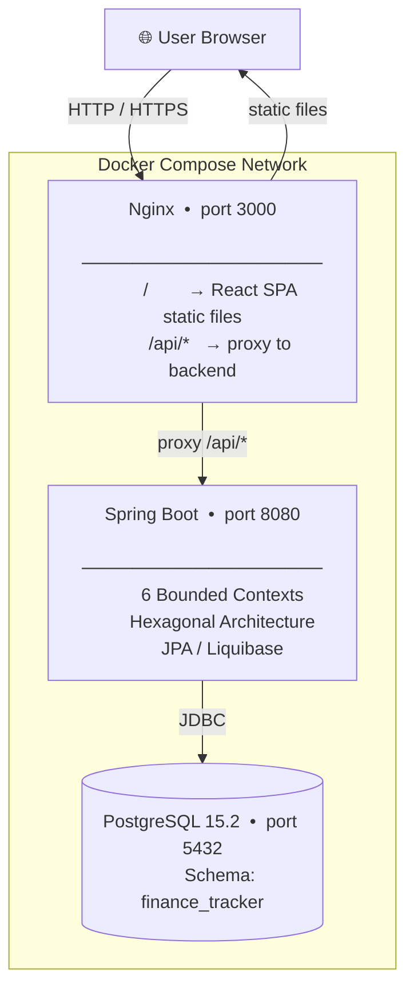

---

## 3. Backend Architecture

### 3.1 Hexagonal Architecture (Ports & Adapters)

Every bounded context follows this structure strictly:

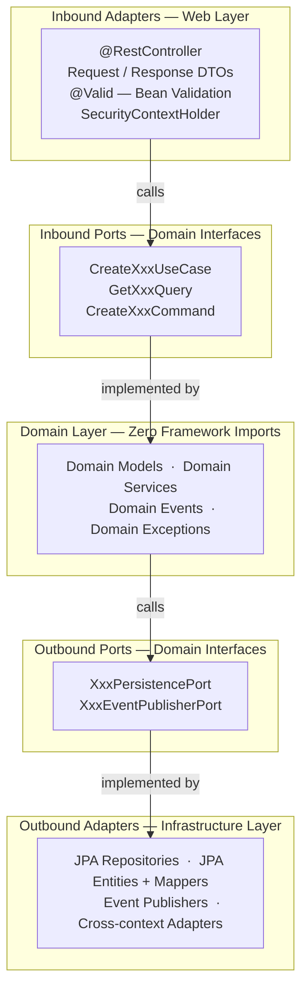

### Package Layout (per bounded context)

```
{context}/
├── domain/
│   ├── model/          → Aggregates, entities, value objects (NO framework imports)
│   ├── service/        → Domain services implementing inbound ports
│   ├── port/
│   │   ├── inbound/    → UseCase + Query interfaces + Command records
│   │   └── outbound/   → Persistence + Event port interfaces
│   ├── event/          → Domain event records
│   └── exception/      → Domain-specific exceptions
├── adapter/
│   ├── inbound/
│   │   └── web/        → @RestController + Request/Response DTOs
│   └── outbound/
│       ├── persistence/ → JPA entity, repository, mapper, adapter
│       ├── event/       → Event publisher adapter
│       └── crosscontext/ → Adapters calling other bounded contexts
└── config/             → @Configuration with @Bean wiring
```

### Bean Wiring Strategy

Domain services are **not Spring beans** — they are plain Java classes. They are instantiated and wired manually in `@Configuration` classes per bounded context:

```java
// IdentityConfig.java
@Bean
public IdentityCommandService identityCommandService(
        UserPersistencePort userPersistencePort, ...) {
    return new IdentityCommandService(userPersistencePort, ...);
}
```

Adapters use `@Component` / `@Repository` for Spring auto-discovery. This keeps the domain layer Spring-free while leveraging Spring for infrastructure.

---

### 3.2 Bounded Contexts

The application has **6 bounded contexts** plus a **shared kernel**:

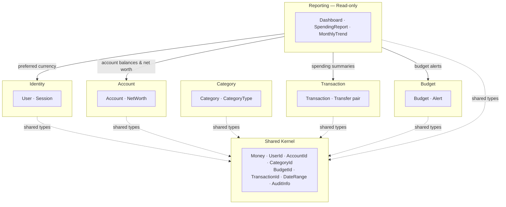

**Context responsibilities**:
- **Identity**: User registration, authentication, session management, profile updates
- **Account**: Financial account CRUD, real-time balance tracking, net worth calculation
- **Category**: Income/expense category taxonomy with system defaults and custom categories
- **Transaction**: Ledger of all financial movements including inter-account transfers
- **Budget**: Spending limits per category with period tracking and alerts
- **Reporting**: Aggregated, read-only views composited from all other contexts

---

### 3.3 Shared Kernel

The shared kernel contains types used across all bounded contexts. These are **pure domain types** with no framework dependencies:

#### Value Objects

**`Money`** — Core financial value object:
```java
public record Money(BigDecimal amount, String currency) {
    public Money add(Money other)       // same currency required
    public Money subtract(Money other)  // same currency required
    public Money negate()
    public boolean isNegative()
    public boolean isPositive()
    public boolean isZero()
    public static Money of(BigDecimal amount, String currency)
    public static Money of(double amount, String currency)
    public static Money zero(String currency)
}
```
- **DB**: `NUMERIC(19,4)` — 4 decimal places, up to 19 significant digits
- **JSON**: serialized as plain string `"123.4500"` (no scientific notation, no floating-point drift)

**Typed IDs** — Prevent primitive obsession:
```java
public record UserId(Long value) {}
public record AccountId(Long value) {}
public record CategoryId(Long value) {}
public record BudgetId(Long value) {}
public record TransactionId(Long value) {}
```

**`AuditInfo`** — Immutable audit record:
```java
public record AuditInfo(OffsetDateTime createdAt, String createdBy,
                        OffsetDateTime updatedAt, String updatedBy) {}
```

**`DateRange`** — Date interval value object:
```java
public record DateRange(LocalDate from, LocalDate to) {
    // validates from <= to
}
```

#### Shared Infrastructure

**`SecurityContextHolder`** — ThreadLocal user context (NOT Spring Security):
```java
public class SecurityContextHolder {
    public static void setCurrentUserId(Long userId)
    public static Long getCurrentUserId()
    public static void clear()
}
```

**`GlobalExceptionHandler`** — Centralized `@RestControllerAdvice`:
- `DomainException` → 422 Unprocessable Entity with `{ code, message }`
- `MethodArgumentNotValidException` → 422 with field-level errors `{ field, code, message }[]`
- `EntityNotFoundException` → 404
- `RuntimeException` → 500

**`AuditableJpaEntity`** — Base JPA entity with automatic audit:
```java
@MappedSuperclass
public abstract class AuditableJpaEntity {
    @Column(name = "created_at") private OffsetDateTime createdAt;
    @Column(name = "updated_at") private OffsetDateTime updatedAt;
    @Column(name = "created_by") private String createdBy;
    @Column(name = "updated_by") private String updatedBy;

    @PrePersist void onCreate() { ... }
    @PreUpdate void onUpdate() { ... }
}
```

---

### 3.4 Domain Layer Rules

Enforced by **ArchUnit** tests at build time:

| Rule | Description |
|---|---|
| No Spring in domain | `*.domain.*` must not import `org.springframework.*` |
| No JPA in domain | `*.domain.*` must not import `jakarta.persistence.*` |
| No Jackson in domain | `*.domain.*` must not import `com.fasterxml.*` |
| No Lombok in domain | `*.domain.*` must not import `lombok.*` |
| Controllers use ports | Controllers must call inbound port interfaces, not domain service classes directly |
| Context isolation | `identity.domain` must not import `account`, `transaction`, `budget`, or `category` packages |
| Context isolation | `account.domain` must not import `transaction` or `budget` domain packages |

---

### 3.5 Cross-Context Communication

Bounded contexts communicate via two mechanisms:

#### 1. Shared Use Case Ports (synchronous)

The **Reporting** context needs data from Account, Transaction, and Budget contexts. Instead of direct domain coupling, it defines outbound ports and has adapters delegate to the other context's inbound ports:

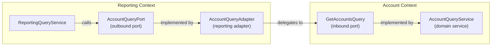

**Example — UserPreferencesPort** (reporting → identity):
```java
// reporting/domain/port/outbound/UserPreferencesPort.java
public interface UserPreferencesPort {
    String getPreferredCurrency(UserId userId);
}

// reporting/adapter/outbound/UserPreferencesAdapter.java
@Component
public class UserPreferencesAdapter implements UserPreferencesPort {
    private final GetCurrentUserQuery getCurrentUserQuery; // from identity
    public String getPreferredCurrency(UserId userId) {
        return getCurrentUserQuery.getCurrentUser(userId).preferredCurrency();
    }
}
```

#### 2. Domain Events (synchronous, MVP)

Domain services publish events via the `EventPublisherPort` outbound port. Adapters subscribe using Spring's `@EventListener`:

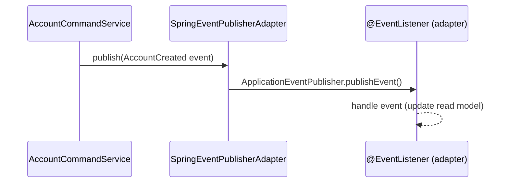

Events are currently synchronous (same transaction). Phase 2 will migrate to async (Kafka/RabbitMQ).

---

## 4. Bounded Context Deep Dives

### 4.1 Identity Context

**Responsibility**: User registration, authentication, session management, profile.

**Domain Model**:
```
User
├── id: UserId
├── username: String (unique)
├── email: String (unique)
├── passwordHash: String (BCrypt)
├── firstName, lastName: String
├── preferredCurrency: String (ISO 4217, e.g. "USD")
├── isActive: boolean
└── auditInfo: AuditInfo

Session
├── id: Long
├── userId: UserId
├── token: String (UUID, opaque)
├── expiresAt: OffsetDateTime
└── isValid: boolean
```

**Inbound Ports**:
- `RegisterUserUseCase.registerUser(RegisterUserCommand)` → UserId
- `AuthenticateUserUseCase.authenticate(AuthenticateUserCommand)` → LoginResult (token + expiry)
- `LogoutUseCase.logout(token)`
- `GetCurrentUserQuery.getCurrentUser(UserId)` → UserProfile
- `UpdateUserProfileUseCase.updateProfile(UpdateUserProfileCommand)` → UserProfile

**Validation Chain for preferredCurrency**:

| Layer | Rule |
|---|---|
| Frontend Zod | `z.string().regex(/^[A-Z]{3}$/)` |
| DTO `@Pattern` | `regexp = "^[A-Z]{3}$"` → HTTP 422 |
| Domain guard | `length != 3` → `IllegalArgumentException` |

**Session Filter** (`SessionAuthFilter extends OncePerRequestFilter`):
1. Extracts `Authorization: Bearer <token>` header
2. Looks up session in DB by token
3. Validates not expired and not revoked
4. Sets `SecurityContextHolder.setCurrentUserId(session.getUserId())`
5. Registered for `/api/*` pattern (order 1)

**Rate Limiting**: In-memory rate limiter on login endpoint (5 attempts / 5 minutes per IP).

---

### 4.2 Account Context

**Responsibility**: Financial account lifecycle and balance tracking.

**Domain Model**:
```
Account (Aggregate Root)
├── id: AccountId
├── ownerId: UserId
├── name: String
├── accountType: AccountType (CHECKING, SAVINGS, CREDIT_CARD, CASH, INVESTMENT, LOAN, DIGITAL_WALLET)
├── currentBalance: Money
├── initialBalance: Money
├── currency: String (ISO 4217)
├── institutionName: String (optional)
├── accountNumberLast4: String (optional, 4 digits)
├── isActive: boolean
├── includeInNetWorth: boolean
├── isLiability: boolean (derived from account type)
├── version: Long (optimistic locking)
└── auditInfo: AuditInfo
```

**Balance Management**:

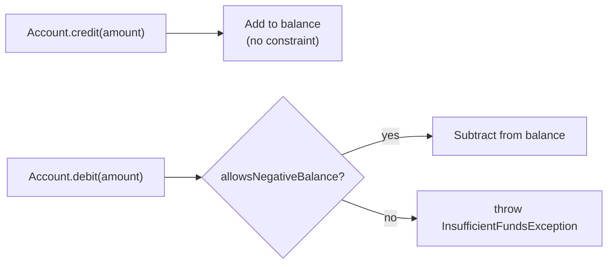

Optimistic locking via `@Version` prevents concurrent balance corruption without pessimistic DB locks.

**Net Worth Calculation**:
```
netWorth = Σ(asset account balances) − Σ(liability account balances)
```
Assets: CHECKING, SAVINGS, CASH, INVESTMENT, DIGITAL_WALLET
Liabilities: CREDIT_CARD, LOAN

---

### 4.3 Category Context

**Responsibility**: Transaction categorization taxonomy.

**Domain Model**:
```
Category
├── id: CategoryId
├── userId: UserId (null for system categories)
├── name: String
├── categoryType: CategoryType (INCOME, EXPENSE, TRANSFER)
├── parentCategory: Category (optional, for sub-categories)
├── icon: String (optional, emoji/icon name)
├── color: String (optional, hex color)
├── isSystem: boolean (seeded defaults, cannot delete)
└── isActive: boolean
```

**System Categories** (seeded via Liquibase `007_seed_system_categories.yml`):

| INCOME | EXPENSE |
|---|---|
| Salary | Groceries |
| Freelance | Dining Out |
| Investment Returns | Transportation |
| Rental Income | Utilities |
| Other Income | Healthcare |
| | Entertainment |
| | Shopping |
| | Housing |
| | Education |
| | Other Expense |

Users can create custom categories (with parent linking for hierarchy) and delete non-system ones.

---

### 4.4 Transaction Context

**Responsibility**: Complete financial ledger — all money movements.

**Domain Model**:
```
Transaction (Aggregate Root)
├── id: TransactionId
├── accountId: AccountId
├── categoryId: CategoryId
├── amount: Money
├── type: TransactionType (INCOME, EXPENSE, TRANSFER_IN, TRANSFER_OUT)
├── transactionDate: LocalDate
├── description: String (optional)
├── merchantName: String (optional)
├── referenceNumber: String (optional)
├── transferPairId: TransactionId (optional, links the two halves of a transfer)
├── isRecurring: boolean
├── isReconciled: boolean
└── auditInfo: AuditInfo
```

**Transfer Mechanism**:

A transfer between accounts creates **two linked transactions** in a single atomic operation:

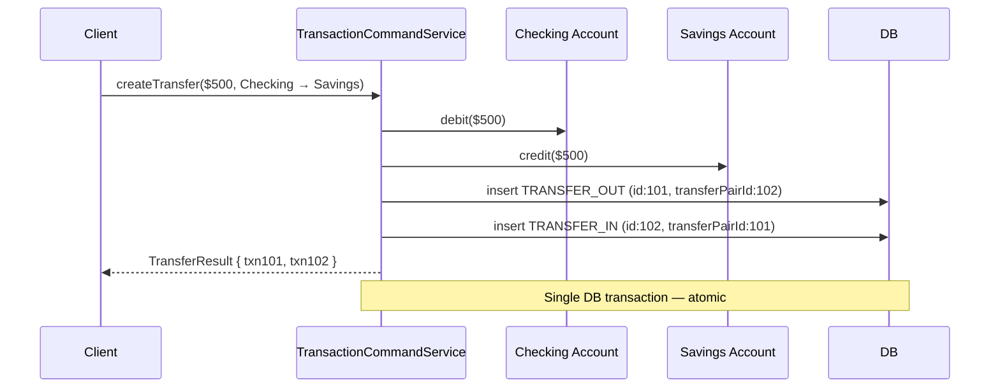

**Pagination**:
```
GET /api/v1/transactions?page=0&size=30
→ { content: [...], page: 0, size: 30, totalElements: 120, totalPages: 4 }

Default page size: 30
Maximum page size: 100 (enforced by WebConfig)
```

**Filters**: `accountId`, `categoryId`, `type`, `from` (date), `to` (date) — all optional, combinable.

---

### 4.5 Budget Context

**Responsibility**: Spending limits per category with progress tracking.

**Domain Model**:
```
Budget (Aggregate Root)
├── id: BudgetId
├── userId: UserId
├── categoryId: CategoryId
├── periodType: BudgetPeriod (WEEKLY, MONTHLY, QUARTERLY, ANNUALLY, CUSTOM)
├── amount: Money (the spending limit)
├── currency: String
├── startDate: LocalDate
├── endDate: LocalDate (optional, required for CUSTOM period)
├── rolloverEnabled: boolean (unused balance carries to next period)
├── alertThresholdPct: Integer (optional, e.g. 80 = alert at 80% spent)
├── isActive: boolean
└── auditInfo: AuditInfo
```

**Runtime Calculations** (computed on read, not stored):
```
spentAmount    = Σ(EXPENSE transactions in this category within period dates)
remainingAmount = amount − spentAmount
percentUsed    = (spentAmount / amount) × 100
alertTriggered = percentUsed >= alertThresholdPct
```

These are computed by joining with the transaction table in the `BudgetQueryService`.

---

### 4.6 Reporting Context

**Responsibility**: Read-only aggregated views. No domain writes — purely queries.

**Dashboard Composition**:

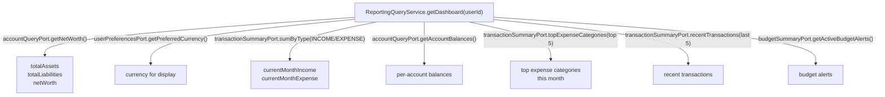

**Trend Report** (`GET /api/v1/reports/trend?months=6`):

Calculates income and expense for each of the last N months, returning a list:
```json
[
  { "month": "2025-01", "income": "4500.00", "expense": "3200.00", "net": "1300.00" },
  { "month": "2025-02", "income": "4800.00", "expense": "2900.00", "net": "1900.00" }
]
```

---

## 5. Database Design

### Schema: `finance_tracker`

All tables use `BIGSERIAL` primary keys, `TIMESTAMPTZ` audit columns, and `NUMERIC(19,4)` for money.

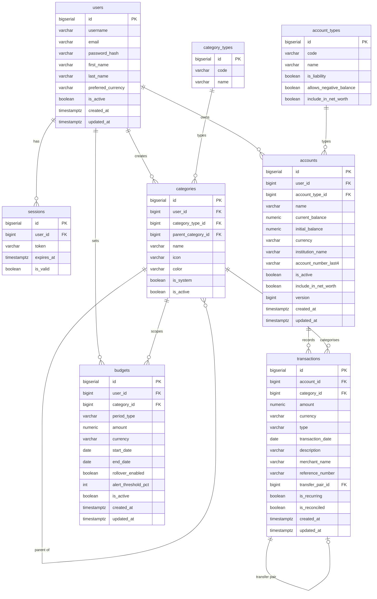

### Liquibase Migration History

| Changeset | Description |
|---|---|
| `001_create_schema` | Create `finance_tracker` schema |
| `002_create_user_and_session_tables` | Users, Sessions tables |
| `003_alter_users_table` | Add firstName, lastName, preferredCurrency to users |
| `004_create_reference_tables` | account_types, category_types, budget_period_types |
| `005_create_accounts_table` | Accounts with NUMERIC(19,4) balance, @Version column |
| `006_create_categories_table` | Categories with self-referencing parent |
| `007_seed_system_categories` | Insert default income/expense categories |
| `008_create_transactions_table` | Transactions with self-referencing transfer pair |
| `009_create_recurring_transactions_table` | Scaffold for recurring transactions |
| `010_create_budgets_table` | Budgets |
| `011_fix_preferred_currency_column_type` | CHAR(3) → VARCHAR(3) |
| `012_fix_char_columns_to_varchar` | Additional CHAR → VARCHAR fixes |
| `013_add_currency_to_budgets` | Add currency column to budgets table |

### Key Indexes

- `accounts(user_id, is_active)` — list user's accounts
- `transactions(account_id, transaction_date)` — paginated transaction history
- `transactions(category_id, transaction_date)` — category-scoped spending queries
- `sessions(token)` — session lookup on every authenticated request
- `budgets(user_id, is_active)` — active budget list

---

## 6. Key Technical Decisions

### 6.1 No Spring Security

**Decision**: Custom token-based auth using `OncePerRequestFilter` and a ThreadLocal context holder.

**Rationale**:
- Simpler for a personal finance app with a single user role
- Avoids Spring Security configuration complexity (filter chains, `UserDetailsService`, `SecurityFilterChain`)
- Full control over session lifecycle (stored in DB, explicitly invalidated on logout)
- Auth token is an opaque UUID (not JWT) — no signature verification overhead

**Trade-off**: Adding OAuth2 or multi-role authorization in the future requires more refactoring than with Spring Security. Acceptable for MVP scope.

---

### 6.2 BigDecimal for All Money

**Decision**: All monetary values use `BigDecimal` in Java and `NUMERIC(19,4)` in PostgreSQL.

**Rationale**:
- `double`/`float` have binary floating-point representation errors (e.g., 0.1 + 0.2 ≠ 0.3)
- Financial calculations require exact decimal arithmetic
- `NUMERIC(19,4)` provides up to 19 significant digits with 4 decimal places — sufficient for any realistic personal finance amount
- JSON serialization as plain string (`toPlainString()`) avoids scientific notation and client-side float conversion

---

### 6.3 Optimistic Locking on Account Balance

**Decision**: JPA `@Version` column on the accounts table.

**Rationale**:
- Account balance is the most concurrency-sensitive field
- Optimistic locking allows non-blocking reads and detects conflicts on write (by checking version match)
- On conflict, JPA throws `StaleObjectStateException` → client retries the operation
- Simpler than pessimistic `SELECT FOR UPDATE` which holds DB row locks

---

### 6.4 Manual DTO Mapping

**Decision**: All domain → DTO and DTO → command conversions are written by hand in controllers and adapters.

**Rationale**:
- Explicit visibility — no hidden mapping magic
- No MapStruct annotation processing overhead
- Easy to debug — the mapping is just a method call
- Domain types and DTOs can evolve independently without annotation coupling

---

### 6.5 Framework-Free Domain Layer

**Decision**: Domain models, services, ports, events, and exceptions contain zero framework imports.

**Rationale**:
- Domain logic is portable and testable with pure JUnit (no Spring test context needed)
- Forced separation of concerns — infrastructure cannot leak into business logic
- Follows the Dependency Inversion Principle exactly

**Enforcement**: ArchUnit tests run on every build and fail if any domain class imports `org.springframework.*`, `jakarta.persistence.*`, `com.fasterxml.*`, or `lombok.*`.

---

### 6.6 Synchronous Domain Events (MVP)

**Decision**: Domain events are published and consumed synchronously via Spring's `ApplicationEventPublisher` + `@EventListener`.

**Rationale**:
- Simplest implementation for MVP
- Same thread, same transaction — guaranteed consistency
- Easy to test without message broker infrastructure

**Future**: Migrate to async processing (Spring `@Async` or Kafka) when reporting or notification requirements demand eventual consistency.

---

### 6.7 Manual Spring Bean Wiring for Domain Services

**Decision**: Domain services are wired via `@Bean` factory methods in `@Configuration` classes, not via `@Service` + `@Autowired`.

**Rationale**:
- Domain services are not Spring beans — they are plain Java
- `@Configuration` class makes all dependencies explicit (no hidden `@Autowired` magic)
- Compile-time safety — missing constructor arguments cause build failure
- Aligns with the Hexagonal principle that domain is framework-agnostic

---

## 7. Frontend Architecture

### 7.1 Component Hierarchy

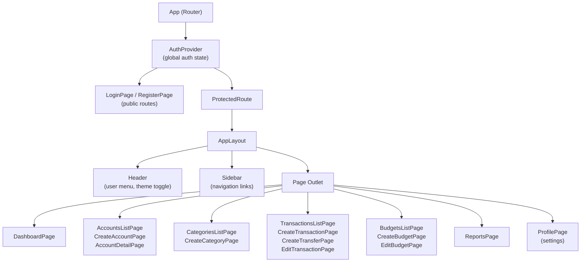

### 7.2 Data Flow

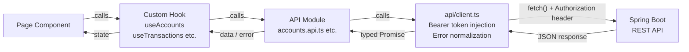

State is local to each page via hooks. No global state management library (Redux/Zustand) — `AuthContext` is the only global state (user profile + auth methods).

### 7.3 Form Pattern

All forms follow this consistent pattern:

```typescript
const schema = z.object({
  name: z.string().min(1).max(100),
  amount: z.string().regex(/^\d+(\.\d{1,4})?$/, 'Invalid amount'),
  // ...
})

const { register, handleSubmit, setValue, formState: { errors, isSubmitting } }
  = useForm<FormType>({ resolver: zodResolver(schema), defaultValues: {...} })

const onSubmit = async (data: FormType) => {
  try {
    await apiCall(data)
    toast.success('Created successfully')
    navigate('/list-page')
  } catch (e) {
    setError(e instanceof ApiClientError ? e.apiError?.message : 'Unexpected error')
  }
}
```

### 7.4 Auth Token Lifecycle

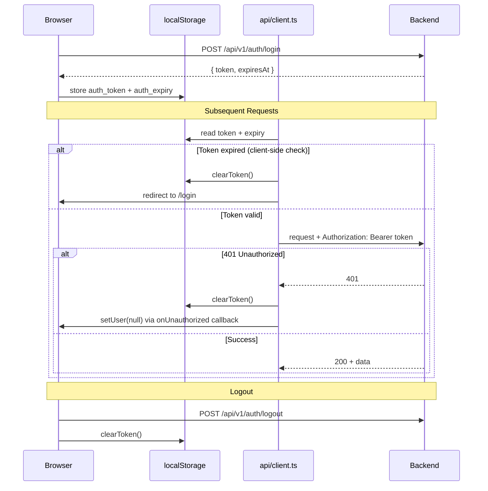

### 7.5 Money Display Currency Resolution

`MoneyDisplay` resolves the display currency with this priority chain:

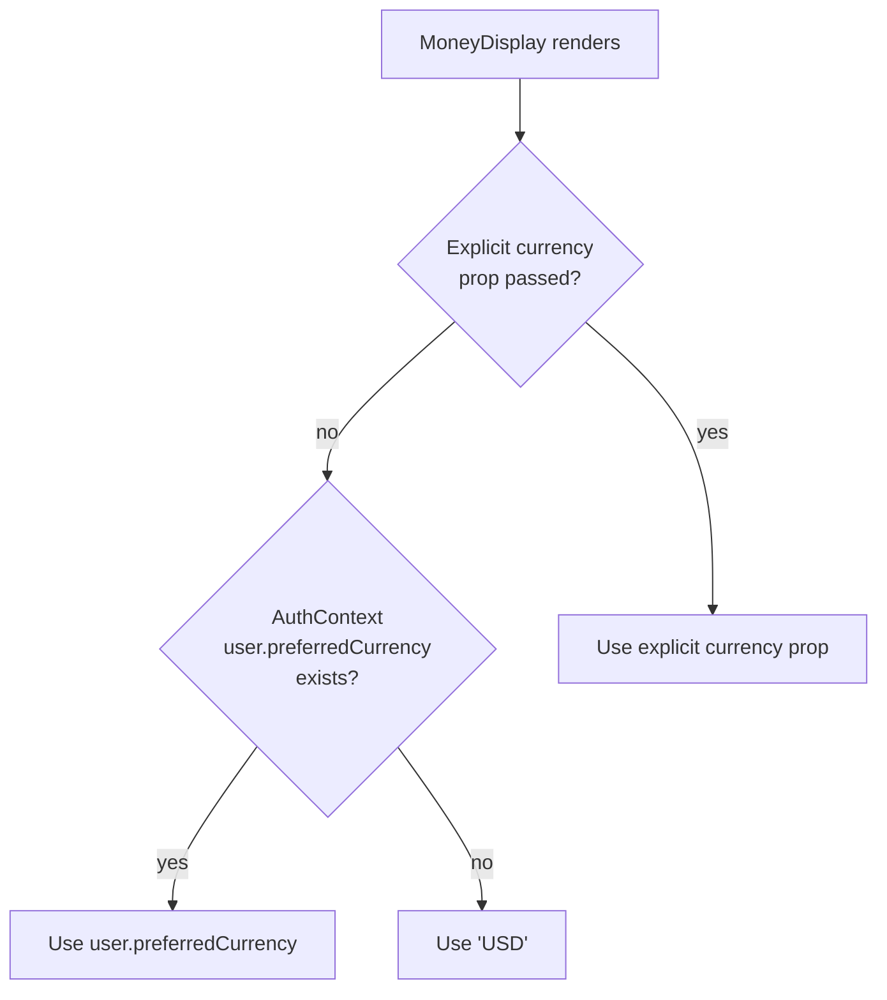

Callers passing an explicit `currency` prop are unaffected when the user changes their preferred currency.

---

## 8. Infrastructure & Deployment

### 8.1 Docker Compose Architecture

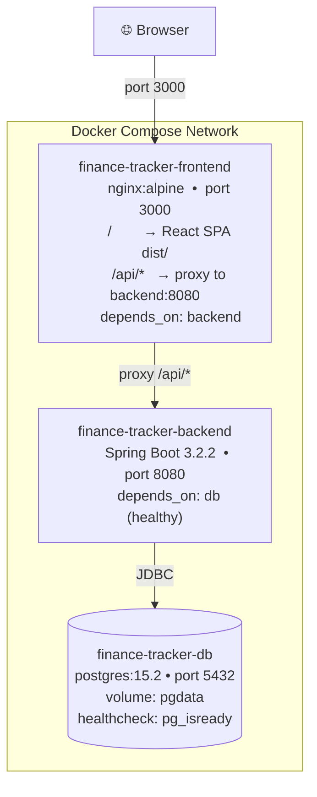

### 8.2 Backend Multi-Stage Dockerfile

```dockerfile
# Stage 1: Build
FROM eclipse-temurin:21-jdk AS build
WORKDIR /app
COPY gradlew gradle/ build.gradle.kts settings.gradle.kts ./
COPY application/build.gradle.kts application/build.gradle.kts
RUN ./gradlew dependencies --no-daemon || true   # cache dependency layer
COPY application/src/ application/src/
RUN ./gradlew :application:bootJar --no-daemon

# Stage 2: Runtime
FROM eclipse-temurin:21-jre-alpine
WORKDIR /app
COPY --from=build /app/application/build/libs/*.jar app.jar
EXPOSE 8080
ENTRYPOINT ["java", "-jar", "app.jar"]
```

**Build optimization**: Dependencies are resolved in a separate layer before copying source code. This means rebuilds only re-compile when source changes, not when dependencies are unchanged.

### 8.3 Frontend Multi-Stage Dockerfile

```dockerfile
# Stage 1: Build
FROM node:20-alpine AS build
WORKDIR /app
COPY package.json package-lock.json* ./
RUN npm ci                          # deterministic install from lockfile
COPY . .
RUN npm run build                   # tsc -b && vite build → /app/dist

# Stage 2: Serve
FROM nginx:alpine
COPY --from=build /app/dist /usr/share/nginx/html
COPY nginx.conf /etc/nginx/conf.d/default.conf
```

### 8.4 Nginx Configuration

```nginx
server {
    listen 80;
    root /usr/share/nginx/html;
    index index.html;

    # API reverse proxy to backend container
    location /api/ {
        proxy_pass http://backend:8080;
        proxy_set_header Host $host;
        proxy_set_header X-Real-IP $remote_addr;
        proxy_set_header X-Forwarded-For $proxy_add_x_forwarded_for;
        proxy_set_header X-Forwarded-Proto $scheme;
    }

    # SPA fallback — all non-asset routes → index.html
    location / {
        try_files $uri $uri/ /index.html;
    }
}
```

The SPA fallback (`try_files ... /index.html`) ensures React Router can handle deep links (e.g., navigating directly to `/accounts/123` returns `index.html`, not a 404).

---

## 9. Security Model

### 9.1 Authentication Flow

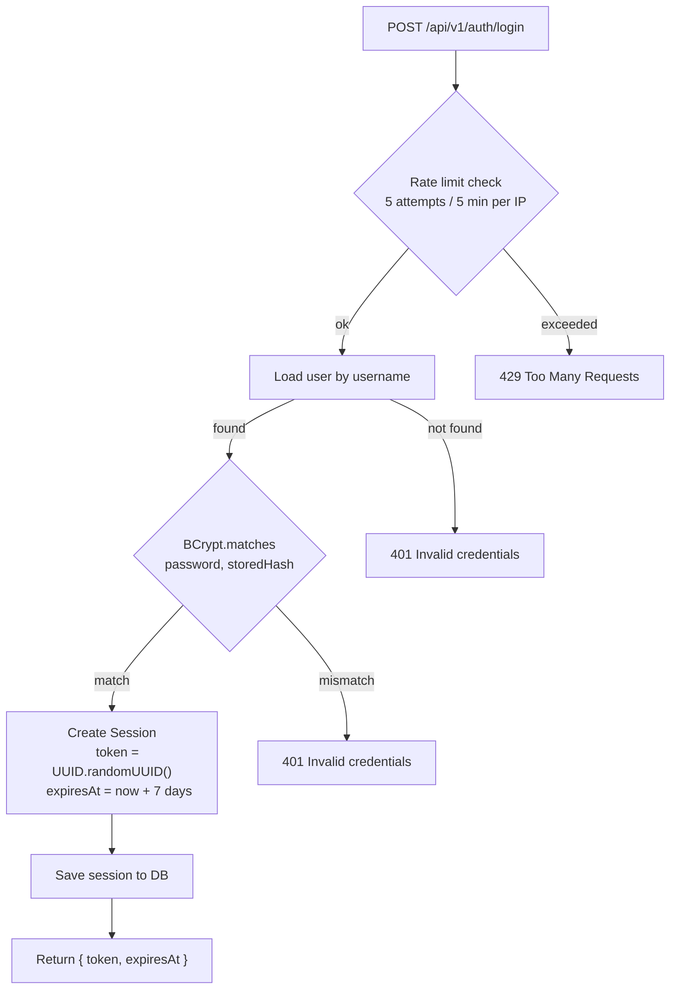

### 9.2 Request Authorization Flow

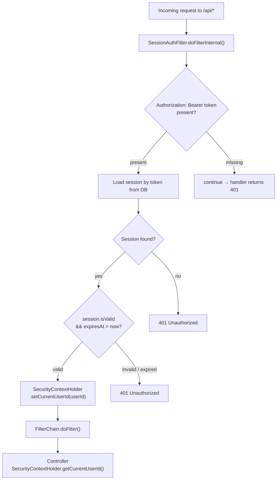

### 9.3 Password Security

- BCrypt hashing via Spring Security Crypto (`BCryptPasswordEncoder`)
- Work factor 10 (default) — computationally expensive to brute-force
- Passwords never stored in plaintext or returned in any DTO
- No password in logs

### 9.4 Input Validation

All inbound DTOs are validated at the HTTP adapter layer before reaching the domain:

| Annotation | Used For |
|---|---|
| `@NotBlank` | Required string fields |
| `@Size(min, max)` | String length bounds |
| `@Email` | Email format |
| `@Pattern(regexp)` | Custom regex (e.g., `^[A-Z]{3}$` for currency codes) |
| `@Min` / `@Max` | Numeric range |

Validation failures return HTTP 422 with field-level error details:
```json
{
  "status": 422,
  "error": "Validation Failed",
  "errors": [
    { "field": "preferredCurrency", "code": "Pattern", "message": "Must be 3-letter ISO 4217 code" }
  ]
}
```

---

## 10. Error Handling

### 10.1 Backend Error Response Format

```json
{
  "status": 422,
  "error": "Unprocessable Entity",
  "message": "User with id 42 not found",
  "errors": [],
  "timestamp": "2025-03-14T10:30:00Z",
  "path": "/api/v1/accounts"
}
```

### 10.2 Exception → HTTP Status Mapping

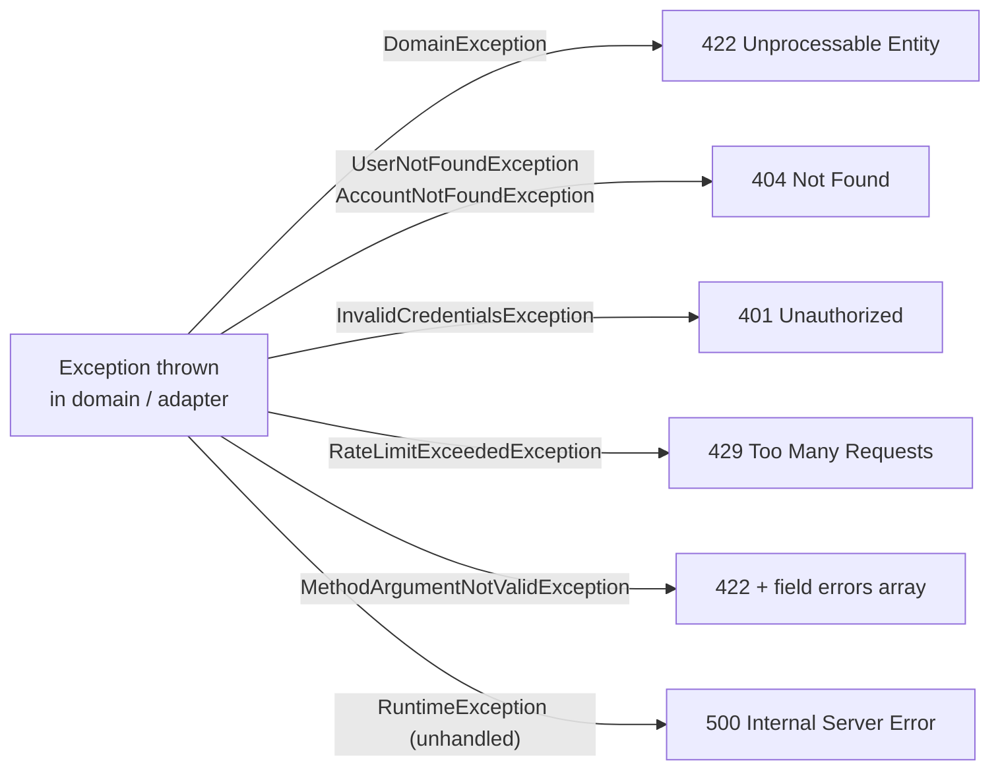

| Exception | HTTP Status |
|---|---|
| `DomainException` (base) | 422 Unprocessable Entity |
| `UserNotFoundException` | 404 Not Found |
| `AccountNotFoundException` | 404 Not Found |
| `DuplicateUsernameException` | 422 |
| `DuplicateEmailException` | 422 |
| `InvalidCredentialsException` | 401 |
| `RateLimitExceededException` | 429 |
| `InsufficientFundsException` | 422 |
| `MaxAccountsExceededException` | 422 |
| `MethodArgumentNotValidException` | 422 (with field errors) |
| `RuntimeException` (unhandled) | 500 |

### 10.3 Frontend Error Handling

```typescript
try {
  await apiCall(data)
  toast.success('Success message')
} catch (e) {
  if (e instanceof ApiClientError) {
    setError(e.apiError?.message ?? 'Operation failed')
    // field errors available at e.apiError.errors[]
  } else {
    setError('An unexpected error occurred')
  }
}
```

`ApiClientError` is thrown by `api/client.ts` whenever the server returns a non-2xx response. It carries the full `ApiError` payload from the backend.

---

*Last updated: March 2026*
