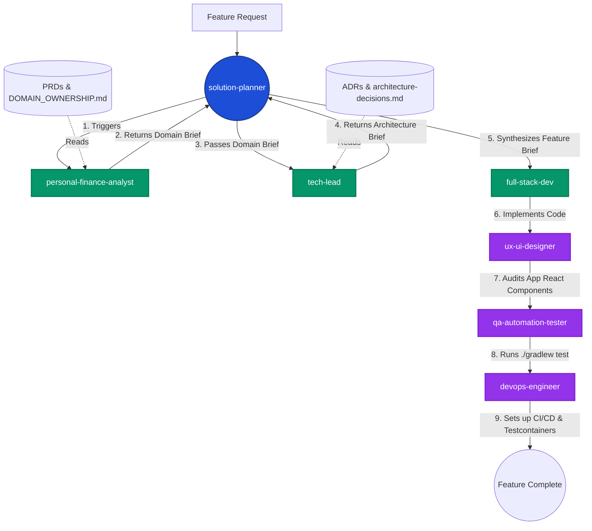

# Zero "Vibe Coding": How I Engineered a Full-Stack Finance App with Claude Code's Multi-Agent Pipeline

When we talk about AI-assisted coding, the conversation usually revolves around "vibe coding"—throwing vague prompts at an LLM, connecting a UI layout tool, and crossing our fingers that the underlying architecture holds together. 

I wanted to see what happens when you treat AI not as a magic wand, but as an embedded enterprise engineering team. To test this, I built a production-ready Personal Finance Tracker entirely from the terminal. I strictly avoided UI Model Context Protocol (MCP) integrations like Figma. Instead, I forced the **Claude Code CLI** into a rigid, Spec-Driven, Multi-Agent Development Environment.

You can check out the final codebase for the project here:  
🔗 **[Personal Finance Tracker on GitHub](https://github.com/shanmuga-sundaram-n/personal-finance-tracker.git)**

## 🎥 The Final Product (Live UI Demo)

Before diving into *how* the AI built this, here is a look at the final application running locally. Notice the clean, modern interface, responsive sidebar navigation, and distinct feature pages (Dashboard, Transactions, Budgets) generated without ever touching a visual design tool:


Here is the story of how I used Claude Code's native features, custom pre/post hooks, and a highly coordinated 7-agent pipeline to not just build an app, but actively *learn* elite database design, Hexagonal Architecture, and accessible UX patterns along the way.

---

## 1. Unleashing Claude Code CLI Features

The Claude Code CLI provides native capabilities that elevate it out of a standard web chat interface. By leveraging the local filesystem, I turned the CLI into an automated powerhouse:

*   **Custom Prompt Hooks (`.claude/hooks/`):** Building a modern React App requires strict linting, and AI can easily format things incorrectly. To solve this, I created a `.claude/hooks/post-edit-lint.sh` script. Every single time Claude Code edited a `.tsx` or `.ts` file, the CLI automatically fired off `$ESLINT_BIN --fix`. This completely eliminated the friction of broken CI builds due to styling errors.
*   **Persistent CLI Memory (`.claude/agent-memory/`):** This is where the magic happens. I stored detailed markdown files (like `DOMAIN-OWNERSHIP.md` and `hexagonal-architecture.md`). Whenever I prompted Claude Code, it automatically fetched this local context to write code compliant with my architectural decisions.
*   **Context Compaction (`/compact`):** Building a complex backend generates massive CLI context. Once Claude finished planning a feature, I simply typed `/compact`. This reset the active context window while keeping the core memories intact, saving tokens and keeping the CLI blazing fast.
*   **Intelligent Commits (`/commit`):** After `./gradlew test` passed, rather than typing out git messages, I ran `/commit`. Claude Code read the actual `git diff` and generated a perfect, semantic commit message right in the terminal before pushing.

### 📸 Simulated Terminal Run: Claude Code in Action
*(Note: As a CLI tool, the true experience is best shown via exact terminal transcripts rather than glossy GUI screenshots).*

```shell
$ claude
╭────────────────────────────────────────────────────────────────────────╮
│ Claude Code (v0.x.x) - Project: personal-finance-tracker               │
╰────────────────────────────────────────────────────────────────────────╯
▶ I want to add double-entry transfers between accounts. Follow the 
  `Transaction.md` PRD and use the solution-planner workflow.

(Claude is thinking...)
[Reading files: docs/product/Transaction.md, .claude/agent-memory/tech-lead/architecture-decisions.md]

I will act as the solution-planner. Let's start the pipeline.
1. Running Domain Analysis against FR-1 (Double-Entry Transfers).
   - The transaction must atomically generate a TRANSFER_OUT and TRANSFER_IN.
2. Running Tech-Lead Architecture Review... 
   - I will utilize a Spring `@Transactional` block.

Would you like me to spawn `full-stack-dev` to implement this now? (Y/n) > y
```

---

## 2. Coordinated Execution: How the 7-Agent Pipeline Built the App

Instead of hooking up an external Figma MCP and letting a single AI guess at the UI and database at the same time, I enforced spec-driven development using a pipeline of 7 distinct Markdown-based personas inside `.claude/agents/`. 

The most impressive part of this project wasn't the AI's coding ability; it was **the strict handoff mechanism** between the agents. They never "spoke" in a chaotic group chat. They communicated by writing strict Markdown files (Briefs) to each other orchestrated entirely by the `solution-planner`.

Here is a visual map of how the agents collaborated without context collapse:



Here is exactly how a feature flowed through this virtual team:

### Step 1: `solution-planner` (The Orchestrator)
The central brain of the CLI. This agent was explicitly instructed to *never* write software code. Its only job was to take my initial feature request, kickstart the pipeline, and gather the outputs of the analysts. 

### Step 2: `personal-finance-analyst` (Domain Brief Generation)
Before pushing code, the planner invoked the analyst. This agent evaluated abstract feature requests against strict Product Requirement Documents (PRDs). It caught financial edge cases—like rounding errors—and generated a **Domain Brief**. It passed this brief back to the planner.

### Step 3: `tech-lead` (Architecture Brief Generation)
The `solution-planner` then took the Domain Brief and passed it verbatim to the `tech-lead`. The architect analyzed the business rules and translated them into Hexagonal Architecture and Liquibase schema designs. It then generated an **Architecture Brief** outlining the exact Java classes, `@Transactional` boundaries, and interfaces needed, catching cross-context import violations before they happened.

### Step 4: `full-stack-dev` (Execution)
The `solution-planner` merged both briefs into one massive **Feature Implementation Brief** and passed it to the developer. Focusing on End-to-End data flow from the PostgreSQL backend to the React Vite frontend, the developer blindly followed the architect's blueprint, avoiding N+1 queries in JPA and utilizing proper React state management.

### Step 5: `ux-ui-designer` (The Anti-Vibe Coding Audit)
By explicitly avoiding UI MCPs, I forced Claude to rely on strict UX heuristics. The planner called this agent to review the `full-stack-dev`'s React code strictly against WCAG 2.1 AA standards, Fitts's Law spacing (touch targets ≥ 44px), and internal design tokens. 

### Step 6: `qa-automation-tester` (The Gatekeeper)
Before closing the feature, this agent ensured no broken code was committed. It wrote integration tests via JUnit and MockMvc, utilized `axe-core` to enforce the designer's accessibility rules, and refused to complete its prompt until `./gradlew test` literally passed in the terminal.

### Step 7: `devops-engineer` (Infrastructure Automation)
Behind the scenes, the devops persona handled all the boilerplate. It configured Testcontainers (`postgres:15.2`) for the QA agent's tests, wrote multi-stage Web/API Dockerfiles relying on Alpine JRE layers, and managed GitHub action caching mechanisms (`~/.gradle/caches`) to slash build times.

---

## 3. Engineering Strict Guardrails (With Code)

To ensure the CLI didn't drift as the conversation grew, I enforced architectural purity with **Hard Automated Constraints** rather than just hoping Claude would follow instructions. Here are all four major guardrails I enforced:

### Guardrail A: Pure Hexagonal Boundaries via ArchUnit
The `tech-lead` instructed the system that the domain layer must be completely unaware of Spring or databases. To physically prevent Claude Code from hallucinating, the `qa-automation-tester` ran **ArchUnit tests**. If Claude generated a `Lombok` or `@Autowired` import inside the domain logic, the build failed physically in the terminal:

```java
// From: com.shan.cyber.tech.financetracker.ArchitectureTest.java
@ArchTest
static final ArchRule domain_must_not_import_spring =
        noClasses()
                .that().resideInAPackage("..domain..")
                .should().dependOnClassesThat()
                .resideInAnyPackage("org.springframework..", "jakarta.persistence..", "lombok..")
                .as("Domain classes must not depend on Spring, JPA, Jackson, or Lombok");
```

### Guardrail B: Clean Wiring Without Framework Pollution
Because the domain must be pure, Claude was expressly forbidden from using `@Service` or `@Component` annotations on core business logic. Instead, the AI learned to construct a dedicated configuration class to wire dependencies manually. This forced the AI to map out the dependency graph explicitly:

```java
// account/config/AccountConfig.java
// Claude routes infrastructure implementations to pure domain services here!
@Configuration
public class AccountConfig {
    @Bean
    public AccountCommandService accountCommandService(
            AccountPersistencePort accountPersistencePort,
            AccountEventPublisherPort accountEventPublisherPort) {
        return new AccountCommandService(accountPersistencePort, accountEventPublisherPort);
    }
}
```

### Guardrail C: Persistent Database Models vs Domain Models
To avoid the classic AI mistake of attaching `@Entity` to a domain object (which allows bad states to bypass business invariants), Claude was forced to maintain two distinctly separate class structures. The JPA Entity was strictly constrained to handle financial concurrency (`@Version`) and precise data types (`BigDecimal`), while the Domain Model solely handled logic. 

```java
// account/adapter/outbound/persistence/AccountJpaEntity.java
@Entity
@Table(schema = "finance_tracker", name = "accounts")
public class AccountJpaEntity extends AuditableJpaEntity {

    @Column(name = "current_balance", nullable = false, precision = 19, scale = 4)
    private BigDecimal currentBalance; // Rule: Must be exactly NUMERIC(19,4)

    @Version // Rule: Required for pessimistic/optimistic locking
    @Column(name = "version", nullable = false)
    private Long version;
}
```

### Guardrail D: Anti-Corruption Layers (Bounded Context Isolation)
If you aren't careful, an AI will simply `import com.domain.transaction.*` inside the `account` module because it's convenient. Claude was barred from this via strict **Anti-Corruption Layer (ACL)** rules. If the `budget` module needed `transaction` data, Claude had to build an explicit cross-context outbound port adapter to decouple them:

```java
// The Budget domain does not import Transaction. It delegates to an interface!
// budget/domain/port/outbound/TransactionSummaryPort.java
public interface TransactionSummaryPort {
    Money sumExpensesForCategory(CategoryId categoryId, LocalDate start, LocalDate end);
}
```

These firm constraints made it impossible for the AI to push code that contradicted the original architecture designed by the `tech-lead`.

---

## 4. Feature Spotlight: Dynamic Budget Aggregation

How well does the CLI handle complex logic without a pre-existing state? 

*From `docs/product/Budget.md`*

**The Challenge:** Storing a physical `spentAmount` column on a Budget table is a common beginner mistake—if you delete a transaction from 3 weeks ago, the budget `spentAmount` goes out of sync.
**The CLI's Solution:** Because Claude Code was forced to follow the PRD rather than writing the easiest code, it leveraged **Guardrail D** to build a **Runtime Synthesis Engine**. It reached out across the Hexagonal outbound port to dynamically compute usage on the fly:

```java
// Inside BudgetQueryService (Domain logic)
Money spentThisPeriod = transactionSummaryPort.sumExpensesForCategory(
    budget.getCategoryId(), 
    budget.getStartDate(), 
    budget.getEndDate()
);
budget.evaluateStatus(spentThisPeriod); // Flags true if spent >= 85% alert threshold
```

### 📸 Simulated Terminal Spotlight: QA execution

```shell
▶ Automatically running QA sequence for the new budget logic...

$ ./gradlew test --tests "com.shan.cyber.tech.financetracker.budget.*"

> Task :application:test
com.shan.cyber.tech.financetracker.budget.domain.BudgetQueryServiceTest
  ✔ dynamic_synthesis_calculates_correct_usage_percent()
  ✔ threshold_alert_triggered_when_over_85_percent()

BUILD SUCCESSFUL in 3s

[Claude]: All tests passed. ArchUnit hex boundaries are clean. Should I `/commit` these changes? (Y/n) > y
```

---

## Final Thoughts: From Chatbot to Engineering Partner

Building a production-ready application with Claude Code CLI reveals a massive shift in how AI should be utilized for software engineering. By rejecting "vibe coding" and external MCP crutches, and instead relying on Claude Code's native hooks, persistent memory, and `/compact` commands, I was able to enforce a rigid, 7-agent spec-driven environment.

This process didn't just build an app for me—it taught me how to properly design scalable databases, orchestrate Hexagonal solutions, and respect WCAG UX heuristics. By forcing Claude Code to respect pipeline personas and automated tests, you don't just get an AI assistant that writes text files—you get a senior engineering team embedded directly in your terminal.
