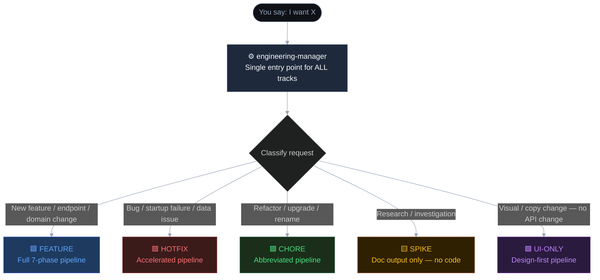
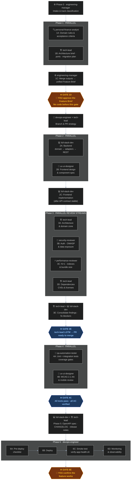
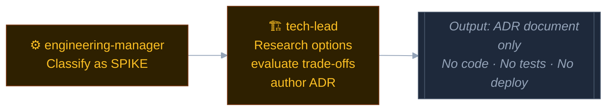
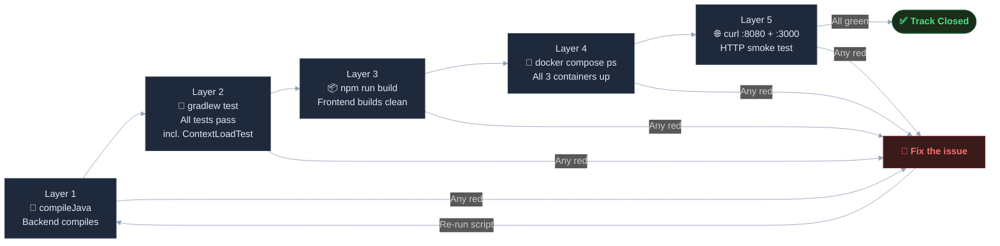

# Agent Pipeline — Personal Finance Tracker

This document describes the Claude Code agent crew that drives all engineering work on this project.
Every request — feature, bug, refactor, research, or UI change — flows through this pipeline.

> **Interactive visual**: Open [`docs/engineering-pipeline.html`](./engineering-pipeline.html) in a browser for a tab-navigable view of all 5 tracks.

---

## Entry Point — Always `engineering-manager`

**No request bypasses `engineering-manager`.** It classifies the track, selects the pipeline, spawns agents, manages gates, and owns delivery end-to-end.



---

## The 9 Agents

| Agent | Role | Pipeline Phase |
|---|---|---|
| `engineering-manager` | Orchestrator — entry point, track classification, gate management | Phase 0, 1C, 1D |
| `personal-finance-analyst` | Domain rules, acceptance criteria, financial invariants, edge cases | Phase 1A |
| `tech-lead` | Architecture decisions, ADRs, code review, final LGTM | Phase 1B, 3A, 3D, 3E |
| `full-stack-dev` | Backend + frontend implementation | Phase 2A, 2C, 3E, 5 |
| `ux-ui-designer` | Design system, mobile-first layout, accessibility (WCAG 2.1 AA) | Phase 2B, 4B |
| `devops-engineer` | Branch/PR strategy, deploy, smoke test, monitoring | Phase 2 (branch), 6A–6D |
| `security-reviewer` | OWASP, auth gaps, financial data exposure | Phase 3B |
| `performance-reviewer` | N+1 queries, DB indexes, frontend bundle size | Phase 3C |
| `qa-automation-tester` | Unit tests, integration tests, coverage gates, migration validation | Phase 4A |

---

## 5 Pipeline Tracks

### FEATURE — Full 7-Phase Pipeline

For new capabilities, new endpoints, domain model changes.



---

### HOTFIX — Accelerated Pipeline

For production bugs, startup failures, data integrity issues.

```mermaid
%%{init: {'theme': 'dark', 'themeVariables': {'primaryColor': '#1e293b', 'primaryTextColor': '#e2e8f0', 'primaryBorderColor': '#334155', 'lineColor': '#94a3b8'}}}%%
flowchart LR
    EM["⚙️ engineering-manager\nClassify as HOTFIX"]
    TL1["🏗️ tech-lead\nDiagnose root cause\nscope minimal fix"]
    FSD["💻 full-stack-dev\nTargeted fix\nno refactoring · no scope creep"]
    TL2["🏗️ tech-lead\n3A: Architecture\nreview of the fix"]
    QA["🧪 qa-automation-tester\nReproduce bug as test\n+ full regression run"]
    DEV["🚀 devops-engineer\nDeploy + smoke test"]
    GATE{{"★ GATE\n👤 YOU confirm bug resolved"}}

    EM --> TL1 --> FSD --> TL2 --> QA --> DEV --> GATE

    classDef hotfix fill:#3b1a1a,stroke:#7f1d1d,color:#f87171
    classDef gate   fill:#78350f,stroke:#f59e0b,color:#fbbf24,font-weight:bold

    class EM,TL1,FSD,TL2,QA,DEV hotfix
    class GATE gate
```



---

### CHORE — Abbreviated Pipeline

For dependency upgrades, refactors, renames — no domain or API change.

```mermaid
%%{init: {'theme': 'dark', 'themeVariables': {'primaryColor': '#1e293b', 'primaryTextColor': '#e2e8f0', 'primaryBorderColor': '#334155', 'lineColor': '#94a3b8'}}}%%
flowchart LR
    EM["⚙️ engineering-manager\nClassify as CHORE"]
    FSD["💻 full-stack-dev\nImplement"]
    TL["🏗️ tech-lead\n3A: Architecture check\n3D: Dependency review"]
    QA["🧪 qa-automation-tester\nFull regression run\nno new tests required"]
    DEV["🚀 devops-engineer\nDeploy + smoke test"]
    GATE{{"★ GATE\n👤 YOU confirm working"}}

    EM --> FSD --> TL --> QA --> DEV --> GATE

    classDef chore fill:#1a2e1a,stroke:#14532d,color:#4ade80
    classDef gate  fill:#78350f,stroke:#f59e0b,color:#fbbf24,font-weight:bold

    class EM,FSD,TL,QA,DEV chore
    class GATE gate
```



---

### SPIKE — Investigation Only

For research questions, technology evaluation. Output is an ADR document — never code.



---

### UI-ONLY — Design-First Pipeline

For visual or copy changes with no API contract change.

```mermaid
%%{init: {'theme': 'dark', 'themeVariables': {'primaryColor': '#1e293b', 'primaryTextColor': '#e2e8f0', 'primaryBorderColor': '#334155', 'lineColor': '#94a3b8'}}}%%
flowchart LR
    EM["⚙️ engineering-manager\nClassify as UI-ONLY"]
    UX1["🎨 ux-ui-designer\nDesign review\n& component spec"]
    FSD["💻 full-stack-dev\nFrontend implementation"]
    TL["🏗️ tech-lead\nConfirm no API\ncontract changes"]
    UX2["🎨 ux-ui-designer\nWCAG 2.1 AA\n& mobile review"]
    DEV["🚀 devops-engineer\nDeploy + quick smoke test\nverify-app-health.sh --quick"]
    GATE{{"★ GATE\n👤 YOU confirm"}}

    EM --> UX1 --> FSD --> TL --> UX2 --> DEV --> GATE

    classDef ui   fill:#2a1a3e,stroke:#581c87,color:#c084fc
    classDef gate fill:#78350f,stroke:#f59e0b,color:#fbbf24,font-weight:bold

    class EM,UX1,FSD,TL,UX2,DEV ui
    class GATE gate
```



---

## Parallel Phases

These phases spawn multiple agents simultaneously to reduce total time:

| Phase | Agents (parallel) | Sequential dependency |
|---|---|---|
| 1A + 1B | `personal-finance-analyst` + `tech-lead` | Both needed before 1C |
| 2A + 2B | `full-stack-dev` + `ux-ui-designer` | 2C waits for 2A API contract |
| 3A + 3B + 3C + 3D | All 4 review streams | 3E waits for all 4 |
| 4A + 4B | `qa-automation-tester` + `ux-ui-designer` | Gate 4C waits for both |

---

## Human Gates

There are exactly **2 points where you must approve** before the pipeline continues:

| Gate | When | What you decide |
|---|---|---|
| **Gate 1D** | After Feature Brief is produced | Approve scope, AC, and complexity before any code is written |
| **Gate 6E** | After smoke test passes | Confirm the deployed feature works as expected |

All other steps are fully automated by the agent crew.

---

## Application Health Feedback Loop

At the end of every track (except SPIKE), the pipeline runs a 5-layer health check:

```bash
.claude/hooks/verify-app-health.sh          # FEATURE, HOTFIX, CHORE
.claude/hooks/verify-app-health.sh --quick  # UI-ONLY (layers 4+5 only)
```



| Layer | Checks | Catches |
|---|---|---|
| 1 | `./gradlew :application:compileJava` | Compile errors, syntax errors |
| 2 | `./gradlew :application:test` — includes `ApplicationContextLoadTest` | Logic bugs, Spring bean wiring failures |
| 3 | `npm run build` | TypeScript errors, bad imports |
| 4 | `docker compose ps` | Containers crashed or not started |
| 5 | `curl :8080` + `curl :3000` | Runtime startup failures |

**All 5 layers must be green before a track is closed.** If any layer fails, the pipeline stops, the issue is fixed, and the script is re-run.

---

## Hook Enforcement

The pipeline is enforced by two mechanisms loaded into every session:

| Mechanism | File | Effect |
|---|---|---|
| `CLAUDE.md` top section | `CLAUDE.md` | Track classification table + hard rules loaded at session start |
| Pre-tool hooks | `.claude/settings.json` | Domain purity, migration guard, bash guard fire on every edit |
| Health script | `.claude/hooks/verify-app-health.sh` | 5-layer app health — run manually or by `devops-engineer` at Gate 6 |

---

## Agent Memory

Each agent maintains a persistent memory file that carries context across sessions:

| Agent | Memory file |
|---|---|
| `engineering-manager` | `.claude/agent-memory/engineering-manager/MEMORY.md` |
| `tech-lead` | `.claude/agent-memory/tech-lead/MEMORY.md` + `architecture-decisions.md` |
| `personal-finance-analyst` | `.claude/agent-memory/personal-finance-analyst/DOMAIN-OWNERSHIP.md` |
| `full-stack-dev` | `.claude/agent-memory/full-stack-dev/MEMORY.md` |
| `ux-ui-designer` | `.claude/agent-memory/ux-ui-designer/MEMORY.md` + `design-system.md` |
| `qa-automation-tester` | `.claude/agent-memory/qa-automation-tester/MEMORY.md` + `testing-strategy.md` |
| `devops-engineer` | `.claude/agent-memory/devops-engineer/MEMORY.md` |
| `security-reviewer` | `.claude/agent-memory/security-reviewer/MEMORY.md` |
| `performance-reviewer` | `.claude/agent-memory/performance-reviewer/MEMORY.md` |

---

## Quick Reference

```
Any request → engineering-manager → classifies track → runs pipeline → health gate → you confirm
```

| I want to… | Track | First step |
|---|---|---|
| Add a new feature / endpoint / page | FEATURE | `engineering-manager` → Phase 0 |
| Fix a bug / app not starting | HOTFIX | `engineering-manager` → `tech-lead` diagnose |
| Upgrade a dependency / refactor | CHORE | `engineering-manager` → `full-stack-dev` |
| Research a technical question | SPIKE | `engineering-manager` → `tech-lead` research |
| Change UI / copy / styling only | UI-ONLY | `engineering-manager` → `ux-ui-designer` |
