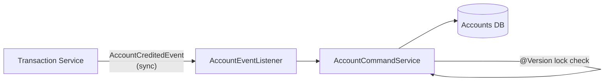

# 📄 Product Requirements Document (PRD) Template

## 1. 🧭 Overview

**Product Name:** Account Ledger bounded context
**Author:** Architect
**Date:** March 2026
**Version:** 1.0

**Objective:**
Provide accurate tracking and real-time balance calculations of all a user's financial accounts (Assets & Liabilities).

**Background / Context:**
To track their financial health, users need to monitor fragmented banking, credit, and investment accounts in one place. Accurate reflection of current standing is foundational for any personal finance app.

---

## 2. 🎯 Goals & Success Metrics

**Business Goals:**
* Provide the core underlying ledger logic required to generate financial insights.

**User Goals:**
* Enable users to register cash, bank, and credit accounts.
* See total net worth accurately calculated at any time.

**Success Metrics (KPIs):**
* Account creation error rate < 1%.
* 100% accuracy in transactional double-entry mapping to balances.
* Fast loading speeds (< 200ms) for Account List querying.

---

## 3. 👤 Target Users

**Primary Users:**
* Individuals tracking personal wealth, balancing checking/savings with active credit card debts.

**User Pain Points:**
* Unable to calculate total net worth easily due to scattered institutions.
* Inadvertently overdrawing accounts because balances aren't tracked historically.

---

## 4. 🧩 Problem Statement

> Users are unable to see their true financial standing because they manage money across multiple institutions, leading to an inaccurate mental model of available capital and total liabilities.

---

## 5. 💡 Proposed Solution

An Account tracking system separating Asset types from Liability types. Every transaction triggers a domain event that adjusts the respective account's balance. Optimistic locking guarantees atomic financial integrity during parallel updates.

---

## 6. 📦 Scope

### ✅ In Scope
* CRUD for financial accounts.
* Real-time balance aggregation.
* Net worth logic based on liability/asset mapping.
* Linking to user's preferred currency gracefully.
* Soft-deletion flow (Deactivate Account).

### ❌ Out of Scope
* Automatic banking integration (Plaid/Yodlee).
* Multi-currency conversion mathematics (cross-currency sums).

---

## 7. 🧪 User Stories

* As a user, I want to add my credit card so that I can track my debt liabilities.
* As a user, I want to hide closed accounts so that my list isn't cluttered, but maintain their historical data.
* As a user, I want my dashboard to represent my total Net Worth based on all included active accounts.

---

## 8. 🖥️ Functional Requirements

### FR-1: Create Asset/Liability Account
**Given** an authenticated user
**When** they create an account typed `CREDIT_CARD` with an initial balance of `500.00`
**Then** the system persists the account as a Liability, enabling it for Net Worth calculations where positive values reflect debt
**Acceptance Criteria:**
- Initial balance must support up to 4 decimal places (`NUMERIC(19,4)`).
- Fails if `accountType` does not exist in seed references.
- For Liability accounts (CREDIT_CARD, LOAN), positive balances mean money is historically owed.
**Sample Data:**
- Account: "Chase Sapphire", Type: `CREDIT_CARD`, Balance: `1500.50`, Currency: `USD`.

### FR-2: Real-time Balance Tracking (Optimistic Lock)
**Given** an account with balance `1000.00` (Version 1)
**When** two transactions attempt to concurrently deduct `200.00` and `300.00`
**Then** the first succeeds updating balance to `800.00` (Version 2) and the second receives a `StaleObjectStateException` prompting a retry
**Acceptance Criteria:**
- No "lost updates" can occur; final balance must be deterministic.
- Prevents overdrafts specifically for `SAVINGS` and `CASH` accounts by throwing `InsufficientFundsException` (Note: `CHECKING` permits overdrafts natively).

### FR-3: Net Worth Summarization
**Given** a user with a `CHECKING` account (`+2000.00`) and a `LOAN` account (`-5000.00`)
**When** they query Net Worth
**Then** the aggregated summary returns `-3000.00`
**Acceptance Criteria:**
- Ignores accounts marked with `includeInNetWorth = false`.
- Summarizes based strictly on `isLiability` markers.

---

## 9. ⚙️ Non-Functional Requirements

* **Data Integrity:** No "lost updates" during parallel transactions.
* **Precision:** `NUMERIC(19,4)` must strictly be enforced down to the frontend JSON string conversion to prevent JS floating-point issues.

---

## 10. 🎨 UX / UI Considerations

* **Card layout:** Accounts display as stylized cards showing Icon, Name, Institution, trailing 4 digits, and stylized positive/negative balances.
* **Totals Header:** Group accounts linearly by "Assets" and "Liabilities" for visual digestion.

---

## 11. 📊 Data & Analytics

* Not tracking raw financials in analytics, but tracking "Accounts Created" to measure user engagement depth.

---

## 12. 🔗 Dependencies

* **Transaction Context:** Relies heavily on incoming events from transactions to credit/debit totals safely.
* **Identity Context:** Defaults fallback to the User's preferred currency.

---

## 13. ⚠️ Risks & Assumptions

**Risks:**
* Race conditions producing inaccurate ledger states.

**Assumptions:**
* Users manually inputting balances means the starting initial balance relies strictly on user accuracy.

---

## 14. 🔄 Alternatives Considered

| Option   | Pros     | Cons    | Decision |
| -------- | -------- | ------- | -------- |
| Calculate balance via dynamic sum of all TXs | Always 100% accurate | Extremely slow at scale | Rejected |
| Maintain `current_balance` with Optimistic Locks | Very fast reads | State mutation risk | Selected |

---

## 15. 🚀 Rollout Plan

* Phase 1: MVP manual account tracking.
* Phase 2: Import CSV mechanism updates.
* Phase 3: Integration with OpenBanking aggregators.

---

## 16. 📅 Timeline

| Milestone       | Date |
| --------------- | ---- |
| Account APIs    | MVP  |
| Optimistic Sync | MVP  |

---

## 🛠️ Architect Mindset Additions

### Architecture Diagram (HLD)



### API Contracts

**GET /api/v1/accounts/net-worth**
```json
{
  "totalAssets": "15400.00",
  "totalLiabilities": "2300.00",
  "netWorth": "13100.00"
}
```

### Event flows (Async Patterns)
Currently utilizing Spring `@EventListener` for synchronous same-transaction consistency. 
*Flow:* `Transaction` saved -> `EventPublisherPort.publish(TransactionCreatedEvent)` -> `Account` Listener executes `accountService.credit/debit()` -> JPA Commits globally.

### Data model snippets
```java
@Entity
@Table(name = "accounts")
public class AccountJpaEntity {
    @Id @GeneratedValue(...)
    private Long id;
    
    @Column(precision = 19, scale = 4)
    private BigDecimal currentBalance;
    
    @Version // <--- Critical for pessimistic overrides
    private Long version;
}
```

### Trade-offs
**Decision:** Storing a snapshot `current_balance` on the Account entity rather than summing up thousands of transactions natively every load.
* **Pros:** `O(1)` read efficiency for dashboard loading.
* **Cons:** Requires strict optimistic locking (`@Version`) to ensure high-velocity simultaneous API calls don't overwrite each other's balance mutations.
* **Mitigation:** Application handles `StaleObjectStateException` gracefully, prompting retry or failing the specific transactional event.
