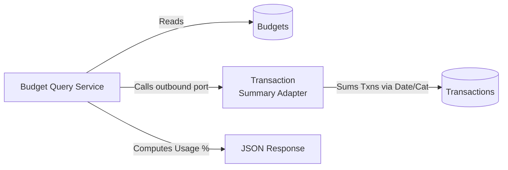

# 📄 Product Requirements Document (PRD) Template

## 1. 🧭 Overview

**Product Name:** Budgeting capabilities
**Author:** Architect
**Date:** March 2026
**Version:** 1.0

**Objective:**
Provide proactive financial spending limits per category and chronologically track user consumption against those boundaries.

**Background / Context:**
Retrospective transactions only tell users what happened in the past. Budgeting allows users to set forward-looking goals and alerts to modify their behavior before they overspend.

---

## 2. 🎯 Goals & Success Metrics

**Business Goals:**
* Increase daily active users by generating meaningful spending alerts.

**User Goals:**
* Prevent overdrawing checking accounts by imposing strict limitations on discretionary spending categories.
* Reward positive saving behaviors by allowing unspent budget capital to "rollover."

**Success Metrics (KPIs):**
* Increase user session frequency to check budget statuses.
* Decrease the frequency of consecutive broken budgets (users actually acting on limits).

---

## 3. 👤 Target Users

**Primary Users:**
* Cost-conscious users strictly allocating paychecks.

**User Pain Points:**
* Realizing they overspent on 'Dining Out' only *after* looking at their monthly bank statement.
* Setting a limit but failing to carry over the 'savings' from last month into the next appropriately.

---

## 4. 🧩 Problem Statement

> Users are unable to govern their discretionary money efficiently because they lack proactive utilization warnings, leading to recurrent overspending on non-essential categories.

---

## 5. 💡 Proposed Solution

A flexible budget tracker defining chronological periods (Weekly, Bi-weekly, Monthly, Quarterly, Semi-annually, Custom) against specific categories. Instead of persisting brittle "spent amounts", the engine dynamically synthesizes exact transaction histories on-the-fly to deliver 100% accurate threshold comparisons and alert triggers.

---

## 6. 📦 Scope

### ✅ In Scope
* Creating categorical spending limits.
* Chronological interval scoping.
* Threshold-based percentage alerting.
* Dynamic utilization aggregation.

### ❌ Out of Scope
* Fully automated algorithmic budget limit suggestions (AI allocation).
* "Envelope" budgeting logic (Zero-based budgeting).

---

## 7. 🧪 User Stories

* As a user, I want to set a $400 monthly constraint on Groceries so I don't buy too many snacks.
* As a user, I want an alert when I hit 80% usage (e.g. $320) so I can restrict my behavior down the stretch.
* As a user, I want my unspent $50 from last week's Gas limit to rollover, giving me a larger buffer this week.

---

## 8. 🖥️ Functional Requirements

### FR-1: Dynamic Chronological Budgets (Parent/Child Tree)
**Given** an active budget for a Parent category ("Entertainment") locked at `$500` `MONTHLY`
**When** the API query is triggered mid-month
**Then** the system actively queries the Transaction context for all expenses strictly within the 1st through the 30th mapped to "Entertainment" AND all of its descendent child categories
**Acceptance Criteria:**
- Synthesizes exact sums; never relies on a drifting cached integer inside the Budget table.
- Converts to correct display currency if there are multi-currency implementations.
**Sample Data:** 
- Transactions Found: `$50` (Parent), `$120` (Child: Streaming). Synthesized `spentAmount`: `$170`. Remaining: `$330`.

### FR-2: Overlap Prevention
**Given** a user has a `WEEKLY` budget for "Groceries"
**When** they attempt to create a `MONTHLY` budget for "Groceries"
**Then** the system returns a `422 Unprocessable Entity`
**Acceptance Criteria:**
- The engine prevents simultaneous overlapping periods on the exact same `categoryId` to avoid UI confusion and aggressive alert collision.

### FR-3: Threshold Alerts
**Given** a budget threshold configured at `85%` for `$1000` limit
**When** a new transaction bumps the calculated `spentAmount` to `$860`
**Then** the returned API entity flags `alertTriggered = true`
**Acceptance Criteria:**
- Calculation uses strict float division: `((spentAmount / amount) * 100) >= alert_threshold_pct`.

---

## 9. ⚙️ Non-Functional Requirements

* **Data Accuracy:** Must strictly include ONLY `.type = 'EXPENSE'` transactions; do not accidentally deduct income generated in that category.

---

## 10. 🎨 UX / UI Considerations

* **Progress Bars:** Represent utilization visually across thresholds (Green < 75%, Amber 75-99%, Red 100%+).
* **Period Switcher:** UI must gracefully allow users to cycle to "Last Month" vs "Next Month" views effortlessly.

---

## 11. 📊 Data & Analytics

* **Alert generation triggers:** Analytics tracking when an alert was logically crossed.

---

## 12. 🔗 Dependencies

* **Transaction Domain:** Entirely reliant on transaction integrity for runtime queries generating utilization rates.

---

## 13. ⚠️ Risks & Assumptions

**Risks:**
* Performance degradation: Summarizing overlapping date ranges for power users with thousands of entries per month.

**Assumptions:**
* `Monthly` will be the drastically overwhelming default `periodType` choice.

---

## 14. 🔄 Alternatives Considered

| Option   | Pros     | Cons    | Decision |
| -------- | -------- | ------- | -------- |
| Physical `spentAmount` Column | Read-time `O(1)` speed | Desync nightmare if a transaction is backdated or deleted | Rejected |
| Runtime Synthesis Joins | Guaranteed 100% accurate state | Potentially slower heavy queries | Selected |

---

## 15. 🚀 Rollout Plan
* Phase 1: MVP tracking & simple alerts.
* Phase 2: Advance push notifications (Email/SMS) on threshold cross.

---

## 16. 📅 Timeline

| Milestone       | Date |
| --------------- | ---- |
| Dynamic API     | MVP  |

---

## 🛠️ Architect Mindset Additions

### Architecture Diagram (HLD)


### API Contracts
**GET /api/v1/budgets**
```json
// Merges static definition with runtime status
{
  "id": 89,
  "categoryId": 5,
  "amount": "400.00",
  "spentAmount": "350.00",
  "remainingAmount": "50.00",
  "percentUsed": 87.5,
  "alertTriggered": true
}
```

### Event flows (Async Patterns)
In future scaled iterations, processing the `TransactionCreatedEvent` async would analyze if the new sum crosses the `alertThresholdPct`, emitting a generic `NotificationEvent(Push)` off the main user-blocking UI thread.

### Data model snippets
```sql
CREATE TABLE budgets (
    id BIGSERIAL PRIMARY KEY,
    user_id BIGINT,
    category_id BIGINT,
    period_type VARCHAR(50), -- WEEKLY, MONTHLY, CUSTOM
    amount NUMERIC(19,4),
    start_date DATE,
    end_date DATE,           -- Can be null unless CUSTOM
    rollover_enabled BOOLEAN,
    alert_threshold_pct INT
);
```

### Trade-offs
**Decision:** Generating `spentAmount` entirely dynamically during the `GET` phase via cross-context adapter ports.
* **Pros:** Complete removal of "Eventual Consistency" headaches. If I delete a transaction today, my budget instantly drops without waiting on complex reconciliation event chains.
* **Cons:** Cross-context reads via API queries can violate pure microservice isolation rules if scaled horizontally to separate containers.
* **Mitigation:** Hexagonal adapters mask the implementation (it's safely behind an `OutboundPort`). If moved to separate servers, that port just becomes an HTTP client rather than a local interface call.
