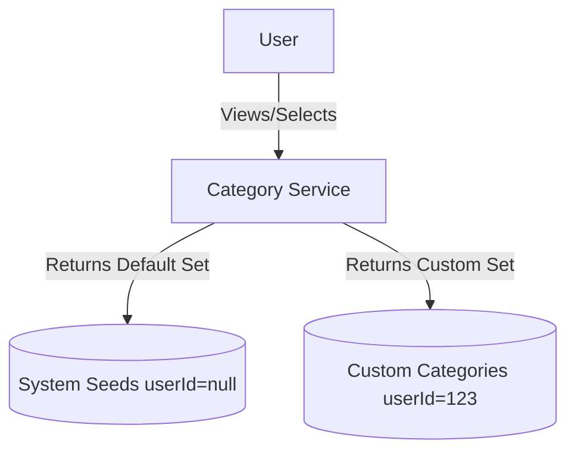

# 📄 Product Requirements Document (PRD) Template

## 1. 🧭 Overview

**Product Name:** Category Taxonomy bounded context
**Author:** Architect
**Date:** March 2026
**Version:** 1.0

**Objective:**
Establish a structured classification system for financial transactions, enabling detailed reporting and budgeting capabilities.

**Background / Context:**
Raw financial transactions lack meaning unless grouped logically. Categories give semantics to cash flow, separating standard living expenses from discretional spending.

---

## 2. 🎯 Goals & Success Metrics

**Business Goals:**
* Create a scalable metadata foundation for system-wide reporting.

**User Goals:**
* Enable personalized organizational habits by custom folder-like categorization.

**Success Metrics (KPIs):**
* Use of categories in 100% of persisted transactions.

---

## 3. 👤 Target Users

**Primary Users:**
* Finance trackers desiring deep analytical insights into their expenditure patterns.

**User Pain Points:**
* Standardized banking apps don't let me define custom sub-categories exactly to my lifestyle (e.g., "Dog Toys" vs just "Pet Expenses").

---

## 4. 🧩 Problem Statement

> Users are unable to analyze their spending habits accurately because flat transaction ledgers provide no semantic grouping, leading to poor financial optimizations.

---

## 5. 💡 Proposed Solution

A dual-tier category taxonomy: System-seeded defaults (immutable) so users have immediate utility on day 1, alongside Custom user-defined hierarchical categories providing infinite flexibility.

---

## 6. 📦 Scope

### ✅ In Scope
* System categories instantiated via Liquibase.
* Custom category CRUD.
* Hierarchical parent/child relationships.
* Icon and color hex assignments.

### ❌ Out of Scope
* Automatic AI categorization of merchant texts.
* Cross-user public category sharing libraries.

---

## 7. 🧪 User Stories

* As a user, I want baseline categories available immediately so I can start logging expenses without heavy setup.
* As a user, I want to assign a green color to income and red to expenses so visual reports are intuitive.
* As a user, I want to create a sub-category 'Cloud Hosting' under 'Software Subscriptions'.

---

## 8. 🖥️ Functional Requirements

### FR-1: Protect System Categories
**Given** an authenticated user
**When** they attempt to delete a system category like "Groceries" (seeded)
**Then** the system denies the request with a `422 Unprocessable Entity`
**Acceptance Criteria:**
- `isSystem` boolean explicitly blocks DELETE requests.
- System categories are read-only except for their global presence.
**Sample Data:**
- `categoryId: 1`, `name: "Groceries"`, `isSystem: true`.

### FR-2: Custom Nested Categories
**Given** an authenticated user
**When** they create a new category typed `EXPENSE` named "Streaming" with parent "Entertainment"
**Then** the system creates it with a `parent_category_id` linked safely to the active parent
**Acceptance Criteria:**
- The parent category must exist and broadly match the child's `categoryType` (e.g. Cannot map an `INCOME` child under an `EXPENSE` parent).
- Validates hex strings for `color` (e.g. `#1DA1F2`).

### FR-3: Soft Deletion
**Given** a custom category linked to 10 historical transactions
**When** the user deletes the category
**Then** the database sets `is_active = false` without hard-deleting the row
**Acceptance Criteria:**
- Preserves historical database integrity for past transactions.
- Future transaction endpoints exclude this specific category from their active dropdown queries.

---

## 9. ⚙️ Non-Functional Requirements

* **Extensibility:** The self-referencing hierarchy must allow nested aggregations cleanly.

---

## 10. 🎨 UX / UI Considerations

* **Visual Pickers:** Embellish standard dropdowns with the user's defined colors/icons. Form validation for valid hex strings.

---

## 11. 📊 Data & Analytics

* N/A

---

## 12. 🔗 Dependencies

* **Budget & Transactions:** Highly depended upon for relational structure matching.

---

## 13. ⚠️ Risks & Assumptions

**Risks:**
* Deep hierarchies causing complex recursive SQL querying limits.

**Assumptions:**
* Restricting nested category depth at the UI layer to 1 or 2 levels is acceptable for Personal apps.

---

## 14. 🔄 Alternatives Considered

| Option   | Pros     | Cons    | Decision |
| -------- | -------- | ------- | -------- |
| Tagging System (Tags instead of Categories)| Highly flexible Many-to-Many | Very difficult to build pie-charts totaling 100%| Rejected |
| Hierarchical Categories | Explicit 1-to-Many mapping for clean math | Less flexible than tags | Selected |

---

## 15. 🚀 Rollout Plan
* Phase 1: Single level custom categories + System seeds.
* Phase 2: Allow parent-linking.

---

## 16. 📅 Timeline

| Milestone       | Date |
| --------------- | ---- |
| Liquibase Seeds | MVP  |

---

## 🛠️ Architect Mindset Additions

### Architecture Diagram (HLD)


### API Contracts
**POST /api/v1/categories**
```json
{
  "name": "Coffee",
  "categoryType": "EXPENSE",
  "icon": "☕",
  "color": "#6F4E37",
  "parentCategoryId": 14
}
```

### Event Flows
Simple synchronous DB persistence. In the future, deleting a category might emit an `CategoryArchivedEvent` so `Transactions` could nullify or remap mappings if soft-delete wasn't handled properly.

### Data Model Snippets
```sql
CREATE TABLE categories (
    id BIGSERIAL PRIMARY KEY,
    user_id BIGINT,             -- Null for System ones
    parent_category_id BIGINT REFERENCES categories(id),
    name VARCHAR(255) NOT NULL,
    is_system BOOLEAN DEFAULT FALSE,
    is_active BOOLEAN DEFAULT TRUE
);
```

### Trade-offs
**Decision:** Implementing soft-deletes (`is_active = false`) for user categories instead of cascading purges.
* **Pros:** Mathematical integrity is maintained for 5-year-old transactions that point to a category the user "deleted" yesterday.
* **Cons:** Dropdowns must specifically filter out `is_active=false` on writes, but reports must be capable of resolving `is_active=false` entities for historical accuracy.
