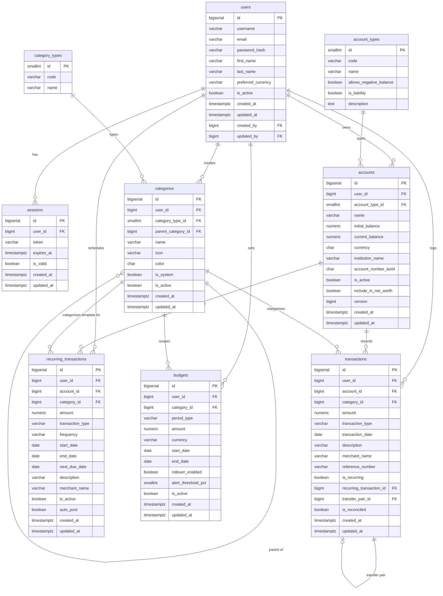

# Personal Finance Tracker: Database ERD & Scripts

This document serves as the single source of truth for the physical database layer. All tables reside under the `finance_tracker` PostgreSQL schema.

---

## 1. Entity Relationship Diagram (ERD)



---

## 2. Master PostgreSQL DDL Scripts

These scripts represent the combined, active schema constructed from the `db.changelog` YAML constraints. Execute sequentially to create the baseline database.

### 2.1 Initialization & Identity Context
```sql
CREATE SCHEMA IF NOT EXISTS finance_tracker;

-- Users Table
CREATE TABLE finance_tracker.users (
    id BIGSERIAL PRIMARY KEY,
    username VARCHAR(50) UNIQUE NOT NULL,
    email VARCHAR(254) UNIQUE NOT NULL,
    password_hash VARCHAR(255) NOT NULL,
    first_name VARCHAR(100) NOT NULL,
    last_name VARCHAR(100) NOT NULL,
    preferred_currency VARCHAR(3) NOT NULL DEFAULT 'USD',
    is_active BOOLEAN NOT NULL DEFAULT true,
    created_at TIMESTAMPTZ NOT NULL DEFAULT NOW(),
    updated_at TIMESTAMPTZ NOT NULL DEFAULT NOW(),
    created_by BIGINT REFERENCES finance_tracker.users(id),
    updated_by BIGINT REFERENCES finance_tracker.users(id)
);

-- Sessions Table
CREATE TABLE finance_tracker.sessions (
    id BIGSERIAL PRIMARY KEY,
    user_id BIGINT NOT NULL REFERENCES finance_tracker.users(id) ON DELETE CASCADE,
    token VARCHAR(255) UNIQUE NOT NULL,
    expires_at TIMESTAMPTZ NOT NULL,
    is_valid BOOLEAN NOT NULL DEFAULT true,
    created_at TIMESTAMPTZ NOT NULL DEFAULT NOW(),
    updated_at TIMESTAMPTZ NOT NULL DEFAULT NOW()
);
```

### 2.2 Account Context & Reference Tables
```sql
-- Account Types (Reference Table)
CREATE TABLE finance_tracker.account_types (
    id SMALLINT PRIMARY KEY,
    code VARCHAR(30) UNIQUE NOT NULL,
    name VARCHAR(100) NOT NULL,
    allows_negative_balance BOOLEAN NOT NULL,
    is_liability BOOLEAN NOT NULL,
    description TEXT
);

INSERT INTO finance_tracker.account_types (id, code, name, allows_negative_balance, is_liability) VALUES
    (1, 'CHECKING',       'Checking Account', true,  false),
    (2, 'SAVINGS',        'Savings Account',  false, false),
    (3, 'CREDIT_CARD',    'Credit Card',      true,  true),
    (4, 'INVESTMENT',     'Investment',       false, false),
    (5, 'LOAN',           'Loan',             true,  true),
    (6, 'CASH',           'Cash',             false, false),
    (7, 'DIGITAL_WALLET', 'Digital Wallet',   true,  false);

-- Accounts Table
CREATE TABLE finance_tracker.accounts (
    id BIGSERIAL PRIMARY KEY,
    user_id BIGINT NOT NULL REFERENCES finance_tracker.users(id),
    account_type_id SMALLINT NOT NULL REFERENCES finance_tracker.account_types(id),
    name VARCHAR(100) NOT NULL,
    initial_balance NUMERIC(19,4) NOT NULL DEFAULT 0,
    current_balance NUMERIC(19,4) NOT NULL DEFAULT 0,
    currency VARCHAR(3) NOT NULL DEFAULT 'USD',
    institution_name VARCHAR(100),
    account_number_last4 VARCHAR(4),
    is_active BOOLEAN NOT NULL DEFAULT true,
    include_in_net_worth BOOLEAN NOT NULL DEFAULT true,
    version BIGINT NOT NULL DEFAULT 0,  -- Crucial for Optimistic Locking
    created_at TIMESTAMPTZ NOT NULL DEFAULT NOW(),
    updated_at TIMESTAMPTZ NOT NULL DEFAULT NOW(),
    created_by BIGINT REFERENCES finance_tracker.users(id),
    updated_by BIGINT REFERENCES finance_tracker.users(id),
    CONSTRAINT chk_accounts_currency CHECK (currency ~ '^[A-Z]{3}$')
);

CREATE UNIQUE INDEX idx_accounts_user_name_ci 
    ON finance_tracker.accounts(user_id, LOWER(name)) WHERE is_active = true;
```

### 2.3 Category Taxonomy Context
```sql
-- Category Types (Reference Table)
CREATE TABLE finance_tracker.category_types (
    id SMALLINT PRIMARY KEY,
    code VARCHAR(20) UNIQUE NOT NULL,
    name VARCHAR(50) NOT NULL
);

INSERT INTO finance_tracker.category_types (id, code, name) VALUES
    (1, 'INCOME',   'Income'),
    (2, 'EXPENSE',  'Expense'),
    (3, 'TRANSFER', 'Transfer');

-- Categories Table
CREATE TABLE finance_tracker.categories (
    id BIGSERIAL PRIMARY KEY,
    user_id BIGINT REFERENCES finance_tracker.users(id), -- NULL means "System Default"
    category_type_id SMALLINT NOT NULL REFERENCES finance_tracker.category_types(id),
    parent_category_id BIGINT REFERENCES finance_tracker.categories(id),
    name VARCHAR(100) NOT NULL,
    icon VARCHAR(50),
    color VARCHAR(7),
    is_system BOOLEAN NOT NULL DEFAULT false,
    is_active BOOLEAN NOT NULL DEFAULT true,
    created_at TIMESTAMPTZ NOT NULL DEFAULT NOW(),
    updated_at TIMESTAMPTZ NOT NULL DEFAULT NOW(),
    created_by BIGINT REFERENCES finance_tracker.users(id),
    updated_by BIGINT REFERENCES finance_tracker.users(id)
);
```

### 2.4 Transaction Ledger & Recurring Engine
```sql
-- Transactions Table (The single source of truth for balances)
CREATE TABLE finance_tracker.transactions (
    id BIGSERIAL PRIMARY KEY,
    user_id BIGINT NOT NULL REFERENCES finance_tracker.users(id),
    account_id BIGINT NOT NULL REFERENCES finance_tracker.accounts(id),
    category_id BIGINT NOT NULL REFERENCES finance_tracker.categories(id),
    amount NUMERIC(19,4) NOT NULL CHECK (amount > 0),
    transaction_type VARCHAR(20) NOT NULL, -- INCOME, EXPENSE, TRANSFER_IN, TRANSFER_OUT
    transaction_date DATE NOT NULL,
    description VARCHAR(500),
    merchant_name VARCHAR(200),
    reference_number VARCHAR(100),
    is_recurring BOOLEAN NOT NULL DEFAULT false,
    recurring_transaction_id BIGINT,
    transfer_pair_id BIGINT REFERENCES finance_tracker.transactions(id), -- Double Entry Logic
    is_reconciled BOOLEAN NOT NULL DEFAULT false,
    created_at TIMESTAMPTZ NOT NULL DEFAULT NOW(),
    updated_at TIMESTAMPTZ NOT NULL DEFAULT NOW(),
    created_by BIGINT REFERENCES finance_tracker.users(id),
    updated_by BIGINT REFERENCES finance_tracker.users(id)
);

CREATE INDEX idx_transactions_acct_date ON finance_tracker.transactions(account_id, transaction_date DESC);
CREATE INDEX idx_transactions_user_date ON finance_tracker.transactions(user_id, transaction_date DESC);

-- Recurring Transactions (Phase 2 Scaffold)
CREATE TABLE finance_tracker.recurring_transactions (
    id BIGSERIAL PRIMARY KEY,
    user_id BIGINT NOT NULL REFERENCES finance_tracker.users(id),
    account_id BIGINT NOT NULL REFERENCES finance_tracker.accounts(id),
    category_id BIGINT NOT NULL REFERENCES finance_tracker.categories(id),
    amount NUMERIC(19,4) NOT NULL CHECK (amount > 0),
    transaction_type VARCHAR(20) NOT NULL,
    frequency VARCHAR(20) NOT NULL, 
    start_date DATE NOT NULL,
    end_date DATE,
    next_due_date DATE NOT NULL,
    description VARCHAR(500),
    merchant_name VARCHAR(200),
    is_active BOOLEAN NOT NULL DEFAULT true,
    auto_post BOOLEAN NOT NULL DEFAULT false,
    created_at TIMESTAMPTZ NOT NULL DEFAULT NOW(),
    updated_at TIMESTAMPTZ NOT NULL DEFAULT NOW(),
    created_by BIGINT REFERENCES finance_tracker.users(id),
    updated_by BIGINT REFERENCES finance_tracker.users(id)
);

ALTER TABLE finance_tracker.transactions 
  ADD CONSTRAINT fk_tx_recurring FOREIGN KEY (recurring_transaction_id) 
  REFERENCES finance_tracker.recurring_transactions(id) ON DELETE SET NULL;
```

### 2.5 Budget Tracker Domain
```sql
-- Budgets Table
CREATE TABLE finance_tracker.budgets (
    id BIGSERIAL PRIMARY KEY,
    user_id BIGINT NOT NULL REFERENCES finance_tracker.users(id),
    category_id BIGINT NOT NULL REFERENCES finance_tracker.categories(id),
    period_type VARCHAR(20) NOT NULL, -- WEEKLY, BI_WEEKLY, MONTHLY, CUSTOM
    amount NUMERIC(19,4) NOT NULL CHECK (amount > 0),
    currency VARCHAR(3) NOT NULL DEFAULT 'USD',
    start_date DATE NOT NULL,
    end_date DATE,
    rollover_enabled BOOLEAN NOT NULL DEFAULT false,
    alert_threshold_pct SMALLINT CHECK (alert_threshold_pct BETWEEN 1 AND 100),
    is_active BOOLEAN NOT NULL DEFAULT true,
    created_at TIMESTAMPTZ NOT NULL DEFAULT NOW(),
    updated_at TIMESTAMPTZ NOT NULL DEFAULT NOW(),
    created_by BIGINT REFERENCES finance_tracker.users(id),
    updated_by BIGINT REFERENCES finance_tracker.users(id)
);

CREATE UNIQUE INDEX idx_budgets_user_cat_period 
    ON finance_tracker.budgets(user_id, category_id, period_type) 
    WHERE is_active = true;
```
