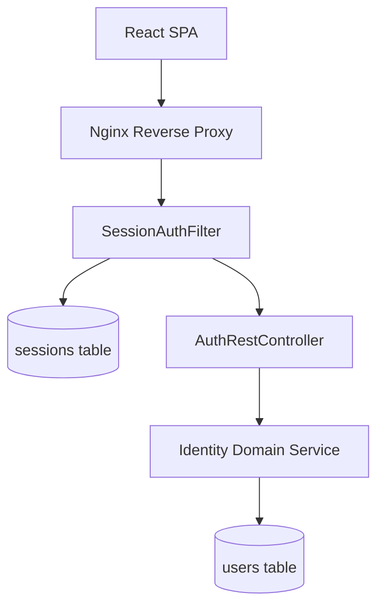

# 📄 Product Requirements Document (PRD) Template

## 1. 🧭 Overview

**Product Name:** Identity & Access Management (IAM) bounded context
**Author:** Architect
**Date:** March 2026
**Version:** 1.0

**Objective:**
Provide secure user onboarding, authentication, session management, and profile customization within the Personal Finance Tracker, while maintaining a pure Domain-Driven Design approach.

**Background / Context:**
Personal finance data is highly sensitive. The application needs a robust, isolated mechanism to handle users, their active sessions, and multi-tenant data segregation. This module lays the foundation for "who" is performing actions in the system.

---

## 2. 🎯 Goals & Success Metrics

**Business Goals:**
* Secure user data with 0% unauthorized access incidents.
* Provide frictionless onboarding/login for users.

**User Goals:**
* Enable users to register securely and manage their personal details (like preferred currency).
* Provide safe logout across devices.

**Success Metrics (KPIs):**
* Account creation success rate > 95%.
* Login latency < 300ms.
* Zero plaintext password leaks.

---

## 3. 👤 Target Users

**Primary Users:**
* Everyday personal finance tracker users needing a reliable way to secure their financial data.
* Admins/Developers debugging session states.

**User Pain Points:**
* Complex, confusing login screens.
* Accidental locking out or session hijacking.
* Inability to set global defaults (like default application currency).

---

## 4. 🧩 Problem Statement

> Users are unable to securely store their disparate financial records because the system lacks a multi-tenant authentication boundary, leading to data mixing and security vulnerabilities.

---

## 5. 💡 Proposed Solution

A custom token-based (UUID) session management system utilizing `OncePerRequestFilter`, built natively without the heavy overhead of Spring Security. It stores physical sessions in the database representing active tokens, alongside BCrypt-hashed passwords for user records.

---

## 6. 📦 Scope

### ✅ In Scope
* Registration & secure login.
* Token-based bearer authentication via headers.
* Profile viewing and editing (First Name, Last Name, Currency).
* Logout (token revocation).
* Rate limiting on login attempts.

### ❌ Out of Scope
* OAuth2 / Social Login (Google, Apple) - Future phase.
* Multi-factor authentication (MFA).
* Forgot Password / Email verification pipelines.

---

## 7. 🧪 User Stories

* As a user, I want to securely register an account so that my financial data is isolated.
* As a user, I want to set a preferred currency so that all my dashboards default to my local tender.
* As a user, I want my session to expire if I forget to log out on a public machine, so that my data remains safe.

---

## 8. 🖥️ Functional Requirements

### FR-1: User Registration
**Given** a guest user is on the registration page
**When** they submit a unique email `test@example.com` and password `SecurePass1!`
**Then** the system should create a user record with a BCrypt hashed password and log them in
**Acceptance Criteria:**
- System must validate email format.
- System must return `422 Unprocessable Entity` if email already exists.
- Password must never be stored in plaintext.
**Sample Data:** 
- Valid: `jane_doe`, `jane@doe.com`
- Invalid Edge Case: `duplicate_username`, `invalid-email-format`

### FR-2: User Login
**Given** a registered user with valid credentials
**When** they submit a login request
**Then** the system should issue a unique UUID Bearer token and set the session expiration exactly 7 days in the future
**Acceptance Criteria:**
- Rate limit triggers HTTP 429 if >5 failed attempts in 5 minutes.
- Returns `401 Unauthorized` for incorrect passwords.
**Sample Data:**
- Input: `test@example.com`, `SecurePass1!` -> Output: `{ "token": "ab12-cd34...", expiresAt: "..." }`

### FR-3: Profile Currency Update
**Given** an authenticated user
**When** they update their preferred currency to `EUR`
**Then** the system validates it against ISO 4217 and persists the update
**Acceptance Criteria:**
- Updates apply instantly to user profile queries.
- Throws error if code is `< 3` or `> 3` characters.

---

## 9. ⚙️ Non-Functional Requirements

* **Performance:** Login API response < 300ms, token verification < 10ms.
* **Scalability:** Support 10,000 active concurrent sessions.
* **Security:** Passwords BCrypt hashed (work factor 10).
* **Availability:** 99.9% uptime.

---

## 10. 🎨 UX / UI Considerations

* **Registration/Login:** Clean, public routes bypassing the standard app layout.
* **Avatar Menu:** Profile edits accessible via top-right avatar dropdown.
* **Currency Input:** Typeahead enforced ISO 4217 standard formatted input logic.

---

## 11. 📊 Data & Analytics

* Failed login attempts (for security/DDoS metrics).
* Number of active sessions globally.

---

## 12. 🔗 Dependencies

* **Frontend:** React Context `AuthProvider` to hold local token logic and global user profile state.
* **Infrastructure:** Database availability for real-time session verification.

---

## 13. ⚠️ Risks & Assumptions

**Risks:**
* Database bottlenecks on token validation for every request.

**Assumptions:**
* Relying on DB rather than Redis for session MVP is sufficient for early scale.

---

## 14. 🔄 Alternatives Considered

| Option   | Pros     | Cons    | Decision |
| -------- | -------- | ------- | -------- |
| Spring Security + JWT | Standard | Complex configuration, hard to revoke tokens immediately | Rejected |
| Custom UUID Sessions in DB | Instant revocation, simple code | DB lookup on every request | Selected |

---

## 15. 🚀 Rollout Plan

* Phase 1: Custom token UUID Database sessions.
* Phase 2: Migrate sessions to Redis cache for speed.
* Phase 3: Add OAuth (Google/Github) sign-on.

---

## 16. 📅 Timeline

| Milestone       | Date |
| --------------- | ---- |
| Base Auth API   | MVP  |
| Profile Configs | MVP  |
| Session Limits  | Post-MVP|

---

## 🛠️ Architect Mindset Additions

### Architecture Diagram (HLD)



### API Contracts

**POST /api/v1/auth/login**
```json
// Request
{ "username": "jane", "password": "SecurePassword1!" }
// Response 200
{ "token": "ab12-cd34...", "expiresAt": "2026-03-24T12:00:00Z" }
```

### Event Flows
Currently synchronous within the `Identity` context. `UserCreatedDomainEvent` could be emitted natively to trigger onboarding emails in the future.

### Data Model Snippets
```sql
CREATE TABLE users (
    id BIGSERIAL PRIMARY KEY,
    username VARCHAR(255) UNIQUE NOT NULL,
    password_hash VARCHAR(255) NOT NULL,
    preferred_currency VARCHAR(3) NOT NULL,
    is_active BOOLEAN
);

CREATE TABLE sessions (
    id BIGSERIAL PRIMARY KEY,
    user_id BIGINT REFERENCES users(id),
    token VARCHAR(255) NOT NULL,
    expires_at TIMESTAMPTZ,
    is_valid BOOLEAN
);
```

### Trade-offs
**Decision:** Using Opaque UUIDs stored in PostgreSQL instead of JWTs.
* **Pros:** Immediate token revocation capabilities (just set `is_valid=false`). No signature parsing logic overhead.
* **Cons:** Every authenticated API request requires a `SELECT` query against the `sessions` table.
* **Mitigation:** Adding an index on `sessions(token)`. If load increases, migrate `sessions` to Redis.
