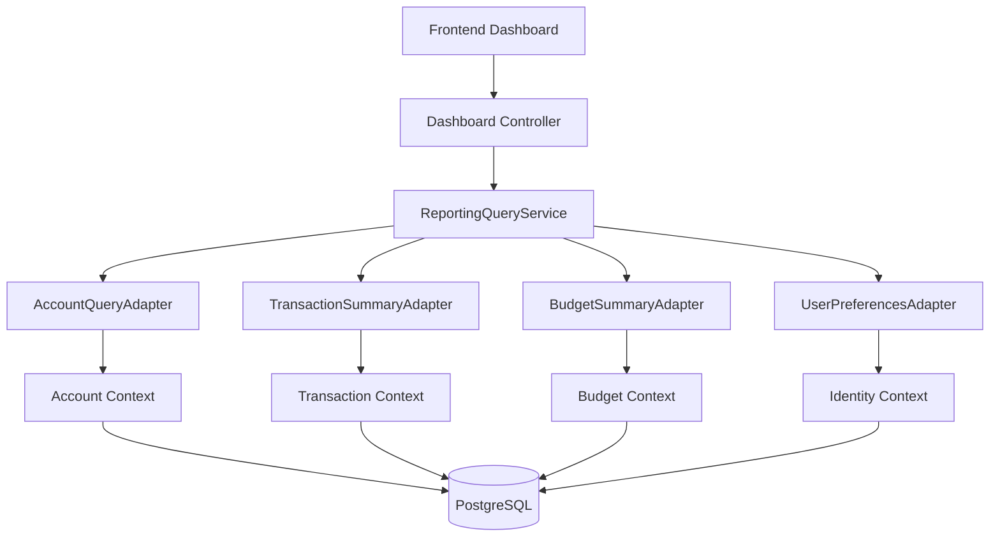

# 📄 Product Requirements Document (PRD) Template

## 1. 🧭 Overview

**Product Name:** Reporting Analytics bounded context
**Author:** Architect
**Date:** March 2026
**Version:** 1.0

**Objective:**
Act as the read-only presentation aggregation layer that structures raw system financial data into visually digestible, cross-domain insights.

**Background / Context:**
Data spread across transactions, accounts, and budgets is only valuable if viewed synthetically. A unified dashboard reduces the cognitive load of a user trying to answer, "How am I doing financially this month?"

---

## 2. 🎯 Goals & Success Metrics

**Business Goals:**
* Deliver the "WOW" factor of the application through beautiful, snappy graphical charting and comprehensive aggregates.

**User Goals:**
* View a singular dashboard upon login summing up net cashflow, net worth, and critical budget alerts.
* Observe historically consistent trends extending retroactively 6 months.

**Success Metrics (KPIs):**
* Time-to-Interact on the core Dashboard page < 500ms.
* Zero rendering crashes when data is null/empty.

---

## 3. 👤 Target Users

**Primary Users:**
* The core user audience demanding quick visualization checks before making purchase decisions.

**User Pain Points:**
* Manually exporting bank data into Excel to generate personal pivot tables and pie charts.
* Finding it difficult to parse raw transaction tables into meaningful "big picture" health checks.

---

## 4. 🧩 Problem Statement

> Users are unable to derive quick, holistic financial awareness because their data is disjointed across specific ledgers and tables, leading to "spreadsheet fatigue" and disengagement.

---

## 5. 💡 Proposed Solution

A uniquely structured read-only Reporting domain that doesn't own databases natively, but heavily coordinates Outbound Queries to other contexts. It merges the responses, applies user-preferred currency localization, and outputs specifically tailored widget/chart payload structures.

---

## 6. 📦 Scope

### ✅ In Scope
* Dashboard composition (Net Worth, Cash Flow, Top Categories).
* Multi-month trend trajectory calculations.
* Monthly spending compositional slicing (Pie Chart representations).

### ❌ Out of Scope
* Highly complex PDF/Excel export functionalities (Post-MVP).
* Algorithmic spending predictions mapping out future months.

---

## 7. 🧪 User Stories

* As a user, I want to log in and immediately see my total computed Net Worth in large digits so I feel grounded.
* As a user, I want a visual pie chart broken down by my explicit Categories so I know exactly where my paycheck evaporated.
* As a user, I want to see a 6-month line graph mapping my incomes against expenses so I can assess my saving momentum.

---

## 8. 🖥️ Functional Requirements

### FR-1: Dashboard Synthesized Assembly
**Given** a validated authentication session
**When** the `/dashboard` endpoint is polled
**Then** the Reporting Engine issues concurrent reads to the Identity, Account, Transaction, and Budget Outbound Adapter ports
**Acceptance Criteria:**
- Must gracefully combine payloads into a singular, mapped front-end visualization DTO.
- Enforces strict zero-leakage read policies (Only queries IDs owned by the authenticated JWT/UUID).
**Sample Data:** 
- Return contains `netWorth` total, `topCategory` objects arrays, and `activeAlerts`.

### FR-2: 6-Month Trend Trajectory
**Given** an active user logging transactions sporadically
**When** the Trend API runs
**Then** it dynamically builds an array mapping exactly 6 preceding calendar months, tallying the total `INCOME` vs `EXPENSE` per distinct block
**Acceptance Criteria:**
- Empty months containing zero transactions must still emit in the array with totals populated mathematically as `"0.00"`.
- Prevents line chart tearing on the front-end by guaranteeing chronological continuity.

### FR-3: Currency Localization Override
**Given** an environment processing calculations natively in USD
**When** a user configured with `EUR` requests reporting
**Then** the view intercepts through the User Preferences Port, formatting layout indicators cleanly as `€`
**Acceptance Criteria:**
- Hard fallbacks to `USD` protect against corrupt profile fetches.

---

## 9. ⚙️ Non-Functional Requirements

* **Read-Only Constraints:** Absolute pure queries. No `@Transactional` write privileges inside the Reporting layer logic to protect application invariants.
* **Resilience:** If the Budgeting sub-query times out or fails (unlikely in monolith), the rest of the Dashboard should arguably still attempt to render degradation gracefully.

---

## 10. 🎨 UX / UI Considerations

* **Charting Library:** Recharts implementation for React, utilizing SVGs scaling flawlessly on Mobile viewports.
* **Component Loading Skeletons:** Renders beautiful shimmer effects outperforming standard loading spinners while the heavy DB cross-joins resolve.

---

## 11. 📊 Data & Analytics

* **Events:** Tracking the user's explicit Date manipulation (e.g., clicking to view past months) to identify deep-usage behaviors.

---

## 12. 🔗 Dependencies

* **Total Coupling:** This aggregate root technically relies upon ALL other contexts: Identity, Accounts, Transactions, Categories, and Budgets.

---

## 13. ⚠️ Risks & Assumptions

**Risks:**
* "Big Ball of Mud" mapping if DTO structures from other bounded contexts fracture or change heavily.
* Cross-joining across thousands of rows blocking the singular connection pool thread heavily on login.

**Assumptions:**
* PostgreSQL optimizations and indexing (specifically `user_id` & `date`) will keep analytical functions sufficiently rapid without needing materialized view scaffolding MVP.

---

## 14. 🔄 Alternatives Considered

| Option   | Pros     | Cons    | Decision |
| -------- | -------- | ------- | -------- |
| CQRS + CDC (Debezium + ElasticSearch)| Insanely fast reads, decoupled | Total overkill infrastructure for MVP | Rejected |
| Standard SQL Aggregations on Demand| Trivial architecture size | Expensive computationally per hit | Selected |

---

## 15. 🚀 Rollout Plan
* Phase 1: Direct SQL Aggregations mapping to standardized Recharts DTOs.
* Phase 2: Implementation of caching responses via Redis for the main Dashboard payload.

---

## 16. 📅 Timeline

| Milestone       | Date |
| --------------- | ---- |
| Dashboard MVP   | MVP  |
| Trend Maps      | MVP  |

---

## 🛠️ Architect Mindset Additions

### Architecture Diagram (HLD)


### API Contracts
**GET /api/v1/reports/trend?months=6**
```json
[
  { "month": "2025-10", "income": "4500.00", "expense": "4100.00", "net": "400.00" },
  { "month": "2025-11", "income": "4800.00", "expense": "2900.00", "net": "1900.00" }
]
```

### Event flows (Async Patterns)
This layer acts purely as a querying nexus. It issues no domain events, nor does it maintain physical event-sourced projections at this MVP phase.

### Data model snippets
N/A - the Reporting domain has strictly zero proprietary JPA Entities. It uses domain interfaces to enforce querying contracts.

### Trade-offs
**Decision:** Providing a single monolithic `GET /dashboard` endpoint combining 5 separate domain summaries vs emitting 5 parallel frontend HTTP `GET` requests from React.
* **Pros:** Greatly limits noisy network traffic protocols over slow mobile connections. Generates identical data snapshots from one singular timestamp state.
* **Cons:** Backend must orchestrate and assemble complex composites. Rejects "lazy loading" of individual dashboard widgets asynchronously if one specific query takes vastly longer than the others.
* **Mitigation:** Future performance tuning could split the "Recent Transactions" into its own lazy-loaded React HTTP hook if the core mathematical widgets (Net Worth, Cash Flow) are throttled by listing text fields.
