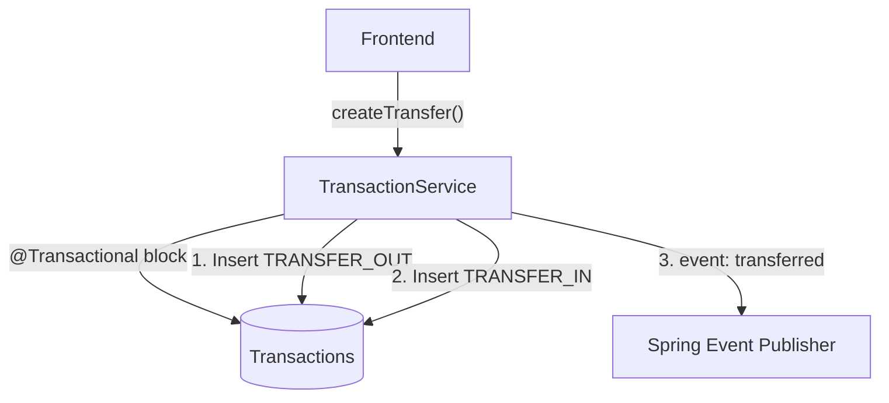

# 📄 Product Requirements Document (PRD) Template

## 1. 🧭 Overview

**Product Name:** Transaction Ledger bounded context
**Author:** Architect
**Date:** March 2026
**Version:** 1.0

**Objective:**
Maintain the immutable, core financial ledger that records every movement of user capital, enabling precise tracking of historical behaviors and transfer mechanisms between personal accounts.

**Background / Context:**
Without a granular record of financial movements, high-level dashboards and bank account balances hold very little actionable meaning. The transactions are the granular building blocks of all personal finance.

---

## 2. 🎯 Goals & Success Metrics

**Business Goals:**
* Provide airtight double-entry mechanisms to ensure money simply isn't created or destroyed during transfers.

**User Goals:**
* Enable users to accurately log every Income, Expense, or Transfer against the appropriate categories and accounts.
* Quickly search, filter, and paginate through years of financial history.

**Success Metrics (KPIs):**
* Zero ledger discrepancies (Transfer OUT perfectly maps to Transfer IN).
* Fast query loads (< 300ms) for high-offset paginated data with filters.

---

## 3. 👤 Target Users

**Primary Users:**
* Everyday users inputting daily expenses (e.g., buying coffee) or reconciling bank feed exports.

**User Pain Points:**
* Reconciling statements is frustrating because simple lists lack filtering mechanisms and internal transfers look like unexplainable income/expenses.

---

## 4. 🧩 Problem Statement

> Users are unable to understand where their money went because their raw bank feeds are disjointed; they lack a unified ledger linking cash movements (expenses) securely to specific categories while preserving inter-account transfer integrity.

---

## 5. 💡 Proposed Solution

A fully paginated, highly filterable transactional ledger. Specifically innovating via a "Transfer Pair" atomic dual-entry architecture where moving money from Checking to Savings guarantees both transaction halves are persisted synchronously.

---

## 6. 📦 Scope

### ✅ In Scope
* Creating standalone Incomes and Expenses.
* Creating 2-sided Transfers between two User accounts.
* Soft-deleting error entries.
* Advanced filtering across time ranges, accounts, and categories.

### ❌ Out of Scope
* Automatic recurring transactions (engine scaffolded, but disabled for MVP).
* Receipt image optical character recognition (OCR) uploads.

---

## 7. 🧪 User Stories

* As a user, I want to log my $5 Starbucks purchase and label it "Dining Out" so it tracks against my budget.
* As a user, I want to transfer $500 from Checking to Savings and see the transaction correctly balanced across both accounts.
* As a user, I want to filter my transactions to show only expenses from last March.

---

## 8. 🖥️ Functional Requirements

### FR-1: Double-Entry Transfers
**Given** an authenticated user with Checking (`$1000`) and Savings (`$0`)
**When** they process a transfer of `$500` from Checking to Savings
**Then** the system atomically generates a `TRANSFER_OUT` and `TRANSFER_IN` pair sharing a `transfer_pair_id`
**Acceptance Criteria:**
- Completely rolls back if one of the `AccountEvent` listeners fails.
- Both transactions reflect mirror opposite balances mathematically updating the respective account aggregates.
**Sample Data:** 
- In: `fromId: 1`, `toId: 2`, `amount: 500`. 
- Out -> DB: Row 1 `TRANSFER_OUT (-500)`, Row 2 `TRANSFER_IN (+500)`.

### FR-2: Filter & Pagination Data Rules
**Given** a ledger with 500 historical transactions
**When** a user queries `/transactions?page=0&size=50&categoryId=5`
**Then** the system evaluates and returns exactly the first 50 transactions matching the criteria, complete with total elements metadata
**Acceptance Criteria:**
- Transaction payloads MUST store purely positive integers (`amount > 0`); the mathematical impact is derived entirely from `transaction_type`.
- Dates cannot be older than 10 years or greater than 30 days into the future.
- Handles empty result sets gracefully.

### FR-3: Sync Balance Recalculation (Soft Delete)
**Given** an account containing a `$200` Income transaction
**When** the user hits delete on that specific transaction
**Then** the transaction flips to `is_active=false` and issues a `TransactionDeletedEvent` dynamically recalculating the upstream Account balance by subtracting `$200`
**Acceptance Criteria:**
- Must accurately reverse the mathematical sign when generating the adjustment event.

---

## 9. ⚙️ Non-Functional Requirements

* **ACID Transactions:** Utilizing Spring `@Transactional` to enforce strict rollbacks if transfer pairs fail halfway.
* **Pagination:** Enforce max page sizes (e.g., 100) to prevent `OutOfMemory` on unbounded `SELECT *`.

---

## 10. 🎨 UX / UI Considerations

* **Infinite Scroll vs List:** Implement traditional or virtualized page lists for navigating history smoothly.
* **Visual Modifiers:** Expenses in red displaying `-`, Incomes in green displaying `+`.
* **Transfer Context:** Specialized transfer inputs distinct from standard expense forms.

---

## 11. 📊 Data & Analytics

* **Events:** "Transaction Logged" frequency to analyze app stickiness.

---

## 12. 🔗 Dependencies

* **Account & Category:** Fully dependent on these boundaries resolving the associated metadata perfectly.

---

## 13. ⚠️ Risks & Assumptions

**Risks:**
* Modifying past transactions resulting in current account balances drifting if not correctly recalculated.

**Assumptions:**
* Users will manually log transactions regularly enough to keep the ledger updated.

---

## 14. 🔄 Alternatives Considered

| Option   | Pros     | Cons    | Decision |
| -------- | -------- | ------- | -------- |
| Store Transfers as 1 Row (To/From columns) | Simpler Schema | Extremely complex reporting (is this an expense or income?) | Rejected |
| Double-Entry Mapping | Pure reporting semantics | Two DB rows per transfer | Selected |

---

## 15. 🚀 Rollout Plan

* Phase 1: Manual entry.
* Phase 2: Recurring transaction daemon execution.
* Phase 3: CSV batch uploads.

---

## 16. 📅 Timeline

| Milestone       | Date |
| --------------- | ---- |
| Transfer Logic  | MVP  |
| Pagination      | MVP  |

---

## 🛠️ Architect Mindset Additions

### Architecture Diagram (HLD)


### API Contracts
**POST /api/v1/transactions/transfers**
```json
{
  "fromAccountId": 12,
  "toAccountId": 15,
  "amount": "500.00",
  "transactionDate": "2026-03-15",
  "description": "Monthly Savings"
}
```

### Event flows (Async Patterns)
Publishes `TransactionCreatedEvent`, `TransactionUpdatedEvent`, and `TransactionDeletedEvent`. 
The `Account` and `Budget` bounded contexts heavily subscribe to these payloads to update real-time caches/balances and trigger threshold notifications.

### Data model snippets
```sql
CREATE TABLE transactions (
    id BIGSERIAL PRIMARY KEY,
    account_id BIGINT REFERENCES accounts(id),
    category_id BIGINT REFERENCES categories(id),
    amount NUMERIC(19,4) NOT NULL,
    type VARCHAR(50) NOT NULL, -- INCOME, EXPENSE, TRANSFER_IN, TRANSFER_OUT 
    transaction_date DATE NOT NULL,
    transfer_pair_id BIGINT REFERENCES transactions(id) -- Atomic mapping
);
```

### Trade-offs
**Decision:** Standardizing every transaction strictly to one account rather than allowing split-transactions (one receipt, multiple categories).
* **Pros:** Mathematical purity when analyzing account movements. Simpler UI form.
* **Cons:** Frustrates users logging a single multi-item Target receipt.
* **Mitigation:** Future phase can introduce a virtual "Split" wrapper object grouping multiple `transactions` visually.
